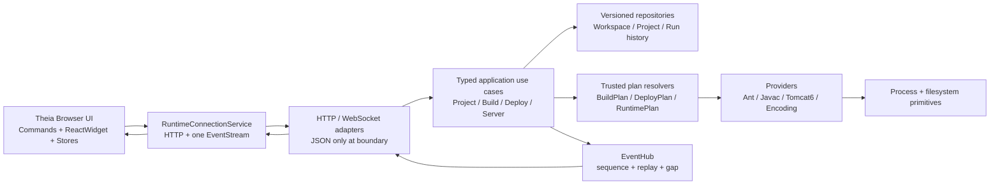

# Kairo IDE 下一轮总任务书：架构收敛、真实主链闭环与发布级验证

> 文档用途：直接交给 DeepSeek V4 Pro 多 Agent 团队执行  
> 文档性质：实施任务书、验收合同、代码重构边界，而不是建议清单  
> 基线日期：2026-07-19  
> 适用仓库：`kairo-ide`  
> 上一份基线：`docs/REARCHITECTURE_AND_IMPLEMENTATION_PLAN.md`  
> 当前结论：上一轮完成了若干有价值的修复和架构骨架，但尚未形成可运行、可验证、单一真相的产品架构

---

## 0. 给执行团队的强制指令

本轮不是继续增加功能数量，而是把已有实现收敛成一条真实可用的桌面 v1 主链：

```text
打开/导入工作区
  → 选择项目与工具链
  → Ant 或 javac 构建
  → 部署到隔离的 Tomcat base
  → 启动 / 重启 / 停止 Tomcat
  → 浏览器访问真实应用
  → 编辑 Java 获得 completion / definition
  → 编辑 GBK/JSP 后按原编码安全保存并同步
```

执行时必须遵守以下规则：

1. **先恢复红线 Gate，再开发业务。** 当前 Go 单测、Go integration、TypeScript 产品构建和编码测试命令均存在失败，不允许在这些失败之上继续叠功能。
2. **只保留一套业务架构。** 禁止让 `internal/app` 新架构和 `internal/services/services.go` 旧架构长期平行存在。
3. **新增文件不等于完成。** 只有从 composition root 接入、被真实入口调用、拥有行为测试并通过 E2E，才能标记完成。
4. **禁止通过 skip、gated、catch 后返回空数组、降低断言、复制生产逻辑到测试中来制造绿灯。**
5. **不允许让客户端提交 `projectRoot`、`outputDir`、`source`、`target`、`javaHome` 等执行路径。** 客户端只提交稳定 ID 和用户意图，Agent 从受信任的 Project/Toolchain repository 解析执行计划。
6. **核心桌面链路不得降级。** Build、Deploy、Start、Restart、Stop、Java completion、definition、GBK round-trip 都是本轮强制验收项。
7. **Remote Server、DAP、插件市场、SQLite、亮色主题、Class HotSwap 不进入本轮。** 不得以这些非主链事项消耗时间。
8. **每个 Agent 开始前先读本任务书与上一份计划。** Integration Agent 对最终合并质量负责，不能只汇总各 Agent 的“已完成”声明。
9. **保留用户已有改动。** 当前工作树不是干净基线；禁止 reset、checkout 覆盖或大范围重写不相关文件。
10. **最终必须给出可复现证据。** 每个 Gate 都要记录命令、退出码、关键日志、生成物位置和实际行为截图。

---

## 1. 本次复核的实际结果

### 1.1 已执行的验证

本次评审不是仅阅读 `MILESTONES.md`，而是实际执行了构建与测试。

| 验证项 | 实际结果 | 结论 |
|---|---|---|
| `go test -count=1 ./...` | 失败 | 多个 encoding API 测试被 sandbox 拒绝 |
| `go vet ./...` | 通过 | 仅说明静态 vet 未发现问题，不代表主链可用 |
| 带 `KAIRO_LEGACY_SAMPLE` 的 Go integration | 失败 | layout 断言失败；无 Tomcat 时 server start 500 |
| `pnpm -r --if-present run build` | 失败 | `@kairo/theia-product` TS6305、TS2742 |
| `pnpm -r --filter './packages/*' test` | 失败 | encoding-extension 缺少 `ts-node/register` |
| Runtime 动态路由测试 | 通过 | 只验证 HTTP client 路径拼接，不验证真实后端契约 |
| command registration 测试 | 通过 | 通过正则读取源码，不实例化 Theia 容器，也不执行命令 |
| encoding `.cjs` 测试 | 表面通过 | 测试复制了一份旧实现，没有调用生产代码，结果不可信 |

因此当前仓库不能声明“上一轮已经完整开发完成”。更准确的状态是：

- 部分旧 Blocker 已修复；
- 新目标架构已经产生一些接口和文件；
- 但新架构没有接替旧运行路径；
- 产品主链仍未闭环；
- CI 设计和测试真实性仍不足；
- 文档状态与实际测试结果冲突。

### 1.2 上一轮值得保留的改进

以下工作方向正确，应保留并完善，不应全部推倒：

1. 修复了 Tomcat Unix/Windows 重复存活检查造成的 Go 编译 Blocker。
2. Agent 启动入口已对非 loopback 地址 fail-closed，符合桌面 v1 收缩范围。
3. 增加了本地运行 secret 的配置字段和 Agent middleware 校验框架。
4. recode 写入开始采用 temp + fsync + rename，方向正确。
5. 前端 `newRequestId` 优先采用 `crypto.randomUUID()`。
6. 新增了 domain、app、repository、provider、event hub 的骨架，为收敛提供基础。
7. 新增 ActiveProject、Import Wizard、Build/Server Store、ReactWidget、主题贡献等 UI 骨架。
8. JDT LS 进程所有权方向已从 Go Agent 转向 Theia backend，这是正确架构方向。
9. `MILESTONES.md` 顶部增加原型阶段警示，开始纠正过度完成声明。
10. CI 开始设置 `KAIRO_LEGACY_SAMPLE`，至少不再让 integration 因缺少该变量整段 skip。

这些改进应作为“可复用素材”，不是完成证明。

---

## 2. 当前阻断问题清单

严重度定义：

- **Blocker**：构建/测试失败，或导致桌面产品完全无法使用。
- **Critical**：主链不可闭环、安全边界错误、存在双真相。
- **High**：核心功能是假的、未接线或测试无法证明行为。
- **Medium**：可维护性、性能、文档一致性问题。

### 2.1 架构与后端

| ID | 严重度 | 当前证据 | 问题与影响 |
|---|---|---|---|
| N-001 | Critical | `cmd/kairo-runtime/main.go` 仍调用 `services.NewMemoryServices` | 新 `domain/app/repository/provider` 完全没有进入生产 composition root，新增架构是死代码 |
| N-002 | Critical | `internal/app/build_impl.go`、`server_impl.go` | 把 `ProjectID` 强制转换成项目磁盘根路径，ID 与路径语义混淆 |
| N-003 | Critical | `app/build_impl.go`、`deploy_impl.go`、`provider/build/javac.go` | `.kairo/project.yaml` 中相对路径没有以 project root 解析；javac 遍历错误目录，deploy sandbox 检查相对路径 |
| N-004 | High | `app/build_impl.go` | `Start` 同步执行构建；Cancel 只改内存状态，不取消进程；Build history 不持久化且返回内部指针 |
| N-005 | High | `provider/build/ant.go` | 没调用 Validate；Ant properties 被放进环境变量而不是可靠的命令行/配置；event sink 完全未使用；无诊断解析 |
| N-006 | High | `provider/build/javac.go` | Walk 错误被吞掉，source root 未基于 project root 解析，output 目录不保证创建，无 argfile，长命令在 Windows 易失败 |
| N-007 | Critical | `app/deploy_impl.go` | 新 DeployEngine 把 classes 直接复制到 webapp root，而非 `WEB-INF/classes`；资源、webapp、lib 的部署语义没有建模 |
| N-008 | Critical | `internal/transport/events/eventhub.go` | EventHub 未注入；同一 workspace 只能保存一个 subscriber，新订阅会覆盖旧订阅；满队列静默丢事件且无 gap 信号 |
| N-009 | High | `internal/platform/hostsupervisor.go` | 这是 Agent 内部无人调用的第二套桌面 supervisor；启动失败时持锁调用 `StopAgent()` 会自锁死锁；应删除而非保留 |
| N-010 | Critical | `internal/api/services.go`、`internal/services/services.go` | RawMessage 万能接口和 God Service 仍是生产架构，新强类型 use case 没有替换它 |
| N-011 | Blocker | Go unit test 实测 | sandbox 只初始化 DataDir；测试 fixture/导入工作区没有形成一致的授权生命周期，encoding API 全部 500 |
| N-012 | Critical | `handleBuilds/handleDeployments/handleServers` | 协议声明 GET list，handler 仍只接受 POST，前端刷新必然失败 |
| N-013 | High | `handleServerLogs` | 错误路径连续调用两次 `writeError`，可能发生重复写响应 |
| N-014 | High | `repository/project_yaml.go` | `SaveProjectConfig` 注释声称 atomic，实际仍用 `os.WriteFile`；没有默认值补全、schema 校验和 migration policy |
| N-015 | High | `repository/atomicfile.go` | 没有先创建父目录；未拒绝未知 schema；Windows 覆盖 rename 行为未验证；fsync 错误被忽略 |
| N-016 | High | `server_impl.go` | Catalina base 使用原始 ProjectID 拼 temp 路径，ID 若包含路径分隔符会错误；plan 只存内存，Agent 重启无法 reconcile |
| N-017 | High | `tomcat6_provider.go` | stop timeout 仍硬编码 15s；URL、ProjectID/WorkspaceID 信息不完整；启动后状态没有事件发布 |

### 2.2 Desktop、运行连接与安全

| ID | 严重度 | 当前证据 | 问题与影响 |
|---|---|---|---|
| N-018 | Blocker | `apps/desktop/src/main.ts` 对比 `runtime.ts` | Desktop 注入 `window.__KAIRO_CONFIG__`，runtime 读取 `__KAIRO_DEFAULT_RUNTIME_URL__`，名称完全不一致 |
| N-019 | Blocker | 同上 | Agent 要求 `X-Kairo-Secret`，前端 KairoRuntime 没有 secret 配置和 header，除 health 外所有请求 401 |
| N-020 | Critical | Desktop `did-finish-load` | 配置在页面脚本执行完成后才通过 `executeJavaScript` 注入，时机太晚且不是安全的 preload/contextBridge |
| N-021 | Critical | Desktop 固定 `THEIA_PORT=3000` | Desktop 仍没有启动/托管 Theia backend，只假设外部开发服务器已运行，不能作为可安装产品 |
| N-022 | High | Desktop child error handler | `runtimeProc.on('error', err => { throw err })` 在事件回调中抛出，可能直接崩溃主进程，Promise 也不会正确 reject |
| N-023 | High | `runtime-connection-service.ts` | 又创建一套固定 18099 的 runtime/event 连接，与现有 `KairoRuntimeImpl/EventStream` 重复，且没有被业务消费 |
| N-024 | High | `runtime.ts` | 现有 EventStream 仍无 sequence replay、heartbeat 和 jitter；本地 secret 也无法用于 WebSocket 鉴权 |
| N-025 | Critical | JDT launch descriptor | Agent 将 `os.Environ()` 整体作为 descriptor 经 HTTP 返回，可能把 token、代理凭据和其他环境 secret 暴露给浏览器进程 |

### 2.3 前端产品编排

| ID | 严重度 | 当前证据 | 问题与影响 |
|---|---|---|---|
| N-026 | Critical | `active-project-service.ts` | 服务没有从 WorkspaceService 初始化、没有持久化、没有自动选择，也没使用注入的 WorkspaceContext |
| N-027 | Critical | `import-wizard-widget.tsx` | “Save Configuration”只执行 `setStep(4)`；用户填写的 source level、encoding、build tool 从未保存 |
| N-028 | High | 同上 | 完成动作无论成功失败都 `window.location.reload()`，错误被吞，可能制造“配置已完成”的假象 |
| N-029 | High | 新 Build/Server Widget | Widget 和 Store 多数只绑定 self，没有 WidgetFactory/ViewContribution，且旧 Kairo widgets 仍在实际产品中，形成两套 UI |
| N-030 | Critical | `kairo-views-contribution.ts` | Restart 命令仍逐个调用 Stop，并没有 Restart/Start；上一轮最明确的 Bug 仍未修复 |
| N-031 | High | `kairo-status-bar-contribution.ts` | server 状态错误仍通过 rejection handler 转为空数组，断线被伪装成“无服务器” |
| N-032 | High | Build/Server Store | 没有 snapshot 加载和 event reducer 接线；页面打开后 store 为空，不代表 Agent 状态 |
| N-033 | High | LogViewerWidget | 只根据 server state 人工生成一条日志，不消费真实 Tomcat log event；“日志视图”仍是演示组件 |
| N-034 | Medium | ui-kit | `tokens.ts`、`KAIRO_DARK_VARS`、CSS 三份主题来源并存；主题强制切换；CSS 文件是否加载没有可靠证明 |
| N-035 | High | product bindings | Runtime、Workspace、ActiveProject、Theme 在多个模块重复 bind/rebind，缺少唯一 composition root，可能产生重复 singleton 或贡献未注册 |

### 2.4 Java Language Intelligence

| ID | 严重度 | 当前证据 | 问题与影响 |
|---|---|---|---|
| N-036 | Critical | `java-language-client-contribution.ts` | 只是包含 id/name/glob 的普通类，不是可运行的 Theia Language Client contribution |
| N-037 | Critical | `java-language-server-contribution.ts` | 能 spawn 进程，但没有把 stdin/stdout 接入 LanguageClient；也没有被 product backend module 加载 |
| N-038 | High | JDT descriptor | workingDir 使用 projectID 字符串；configuration 指向新建空目录，未证明是 JDT LS 对应平台配置目录 |
| N-039 | High | protocol | 仍声明 `DELETE /api/v1/jdtls` 和旧 `JdtStartRequest`，后端已明确不支持 DELETE，协议再次漂移 |
| N-040 | High | JDT distribution | 必须继续核实版本、固定 URL、SHA-256、平台 config 和 JRE 17；“能生成 descriptor”不等于 Java intelligence 可用 |

### 2.5 测试、CI 和文档真实性

| ID | 严重度 | 当前证据 | 问题与影响 |
|---|---|---|---|
| N-041 | Blocker | `go test ./...` | 当前主 Go Gate 失败，但 MILESTONES 仍写 `go test -race ./... passes` |
| N-042 | Blocker | integration 实测 | CI 的 go-integration job 没准备 Tomcat，却强制执行 server start；当前必然失败 |
| N-043 | Blocker | TypeScript build 实测 | product build有 TS6305/TS2742；本地增量输出也不具备可复现性 |
| N-044 | Blocker | package test 实测 | encoding test script 引用未声明的 `ts-node/register` |
| N-045 | Critical | `encoding-service.test.cjs` | 测试重新实现生产逻辑而不是 import 生产代码；即使生产实现错误也会通过 |
| N-046 | High | `kairo-commands.test.cjs` | 仅用正则检查源码字符串，无法证明 Inversify/Theia 真的注册并执行命令 |
| N-047 | Critical | `ui-full-chain.cjs` | 注释声称 UI-only，实际直接调用 Agent API；未打开 Java 文件、未验证 completion/F12、未验证 build/deploy UI 结果 |
| N-048 | Critical | 同上 | server 等核心步骤允许 GATED 后仍退出 0，不能作为 release gate |
| N-049 | High | `verify-e2e.ps1` | 使用 projectId-only 新意图请求，但生产 handler 仍走旧 path-based payload，Windows E2E 契约不一致 |
| N-050 | High | `MILESTONES.md` | 顶部警示与底部“honestly working”互相矛盾；同一文档同时声称测试通过和前端未构建 |

---

## 3. 本轮总体设计决策

### 3.1 哪些必须推倒重做

以下不是局部修补问题，必须替换：

1. **生产 composition root。** 新 app/use case 必须成为唯一业务入口，旧 `NewMemoryServices` 不再承载核心业务。
2. **RawMessage application contract。** JSON 只能存在于 HTTP adapter 边界，进入 use case 后必须是强类型 command/query。
3. **ProjectID 当路径。** ID 永远是 opaque identifier；路径只从 repository 中解析。
4. **Desktop 配置注入和启动模型。** 使用 preload/contextBridge 或 Theia Electron 官方启动机制，不得 `did-finish-load + executeJavaScript`。
5. **事件体系。** 实现真正的 EventHub + WebSocket adapter + snapshot/replay，而不是接口、内存类和前端 socket 三者互不连接。
6. **Java integration。** 普通 POJO scaffold 必须替换为真实 Theia backend language server contribution 和 browser LanguageClient。
7. **假 E2E。** 核心步骤不得 gated，不得用 direct API 替代 UI 行为验证。
8. **双 UI。** 新 React widgets 与旧 widgets 二选一，以新 Store/ReactWidget 架构替代旧 innerHTML 实现后删除旧实现。

### 3.2 哪些保留并重构

1. `internal/build` 现有 javac compiler、diagnostic parser 可作为 JavacProvider 底层实现。
2. `internal/deploy/sync.go` 可作为部署文件同步原语，但必须由 DeployPlan 驱动并执行 sandbox 校验。
3. `internal/tomcat6` 可保留为 Tomcat6Provider 的进程执行层。
4. `internal/security`、`internal/encoding`、`internal/search`、`internal/toolchain` 的已有能力保留。
5. 新 `domain/app/repository/provider` 目录保留，但要修正语义、补测试并正式接线。
6. ActiveProject、BuildStore、ServerStore、React widgets 保留概念，补齐生命周期和产品绑定。
7. Kairo Dark 保留，但只允许一个 token/source pipeline。

### 3.3 本轮明确不做

- 不引入 SQLite。
- 不开发 Remote Server 认证体系。
- 不实现 DAP/JDWP 调试 UI。
- 不开发第三层 runtime plugin。
- 不做 Maven/Gradle/Spring Boot provider。
- 不做 class HotSwap；只承诺 JSP/static/resource sync。
- 不做亮色主题。
- 不做 AI 功能、市场、SSO、cgroup。

---

## 4. 目标架构



唯一允许的依赖方向：

```text
transport → app → domain
                  ↑
repository/provider 实现 app/domain 定义的 port
```

禁止：

- domain import api/json/http；
- app 把 ID 转成路径；
- provider 自己寻找任意项目；
- handler 直接操作文件和进程；
- browser widget 直接 fetch；
- 同一种状态同时存在旧 widget cache、新 store 和 status polling 三套真相。

---

## 5. 多 Agent 执行组织

建议使用 6 个角色，但按 Wave 控制并行，避免多人同时修改 composition root 和 protocol。

### 5.1 角色

| 角色 | 主要责任 | 禁止越界 |
|---|---|---|
| Integration Lead | 基线、架构决策、合并、Gate、文档状态 | 不接受口头完成声明 |
| Agent A — Backend Core | domain/app/repository/plan resolver/composition root | 不改前端 UI |
| Agent B — Runtime Providers | Ant/Javac/Deploy/Tomcat/process/events | 不自行改变 wire protocol |
| Agent C — Protocol & Frontend | protocol、runtime connection、active project、stores、widgets | 不绕过 Agent 执行本地文件操作 |
| Agent D — Java & Desktop | Theia backend JDT、Desktop host、preload、安全配置 | 不实现 Remote/DAP |
| Agent E — QA & Evidence | unit/contract/integration/Playwright/Windows/docs evidence | 不复制生产逻辑造测试 |

### 5.2 并行规则

1. Wave 0 由 Integration Lead + Agent E 完成，其他 Agent 只读审计。
2. Wave 1 中 Agent A 与 B 可并行，但 protocol 冻结前 Agent C 不修改 EndpointMap。
3. composition root 只能由 Agent A 修改，Integration Lead 审核。
4. protocol 只能由 Agent C 修改；后端 handler DTO 由 Agent A 根据冻结契约实现。
5. Java 与 Desktop 在 runtime config contract 冻结后并行。
6. E2E 由 Agent E 编写，但必须由功能 Agent 提供稳定 test IDs 和可观察状态。
7. 每个 Wave 合并后全量 Gate；未通过不得进入下一 Wave。

---

## 6. Wave 0：恢复可信基线（必须首先完成）

### W0-1 清理构建可复现性

任务：

1. 清理本地生成的 `lib/`、`node_modules/`、`.DS_Store`、`*.tsbuildinfo` 对判断的干扰；确认它们不进入 Git。
2. 修正所有 package 的 `main`/`types` 路径。若输出是 `lib/index.d.ts`，不得声明 `lib/src/index.d.ts`。
3. 解决 `@kairo/theia-product` TS6305 和 TS2742：
   - 使用明确的 `ContainerModule` 类型注解；
   - 统一 TypeScript project reference 输出；
   - 从全新 checkout/无 build artifact 状态验证。
4. encoding tests 统一使用 Node 内置 test runner 或声明完整测试依赖，禁止脚本指向不存在的 `ts-node/register`。
5. `pnpm build` 和 CI 使用同一命令，禁止本地一套、CI 一套。

验收：

```bash
pnpm install --frozen-lockfile
pnpm clean
pnpm build
pnpm test
pnpm lint
```

全部退出 0；不得依赖上一次编译残留。

### W0-2 修复当前 Go 红灯

任务：

1. 修复 encoding API 测试 sandbox fixture：测试必须模拟真实“打开 workspace 后授权该 root”的生命周期。
2. 明确 `WorkspaceRoots` 是否支持运行时 Add/Remove：
   - 创建/打开 workspace 后添加 canonical root；
   - 关闭 workspace 后仅在无其他引用时移除；
   - symlink escape 继续拒绝。
3. 修正 integration layout fixture 与真实 `legacy-sample` 的期望，不得硬编码已经不存在的 `WebRoot` 布局。
4. go-integration job 二选一：
   - 准备真实 Tomcat 后执行完整 test；或
   - 拆成 `integration-no-runtime` 和 `integration-tomcat6`，前者绝不进入 server start。
5. 禁止因为环境缺 Tomcat 而让“完整 integration”返回成功。

验收：

```bash
cd runtime-agent
go test -count=1 ./...
go test -count=1 -race ./...
KAIRO_LEGACY_SAMPLE=../legacy-sample go test -count=1 -tags=integration ./test/integration/...
```

完整 Tomcat job 另给一条可复制命令并实际通过。

### W0-3 重写状态台账

1. 将 `MILESTONES.md` 改为当前状态矩阵，不再保留互相冲突的历史完成描述。
2. 每项只允许：`verified`、`partial`、`not started`、`blocked`。
3. `verified` 必须链接到测试文件和 CI job。
4. 历史记录移入 `docs/archive/`，不要在当前状态页混写。
5. 新增 `docs/progress/NEXT_ITERATION_BASELINE.md`，记录 Wave 0 命令与结果。

### Wave 0 Gate

- Go unit/race 全绿；
- TS clean build/test/lint 全绿；
- integration 不 skip 核心已声明范围；
- MILESTONES 不再包含已知虚假声明；
- 没有修改业务功能来回避测试。

---

## 7. Wave 1：后端架构收敛与 Project 单一真相

### W1-1 修正 domain model

必须修改：

1. `Project` 使用单一 `ID ProjectID`，不要同时存在含义混乱的 `ID WorkspaceID` 和 `ProjectID`。
2. 路径类型分两类：
   - repository 内部保存 canonical absolute project root；
   - project config 保存相对路径，如 `src/main/java`、`WebRoot`。
3. 增加明确的 `ResolvedProject` 或 resolver 输出，所有相对路径在一个地方解析并 sandbox 校验。
4. Build/Deploy/Runtime plan 只能由 resolver 创建；字段构造不对 UI 暴露。
5. ID 使用不可猜测或稳定生成策略，但绝不包含 `/`、`\`、`..`。

建议接口：

```go
type ProjectRepository interface {
    Get(ctx context.Context, workspaceID WorkspaceID, projectID ProjectID) (Project, error)
    List(ctx context.Context, workspaceID WorkspaceID) ([]Project, error)
    Save(ctx context.Context, project Project) error
}

type PlanResolver interface {
    ResolveBuild(ctx context.Context, workspaceID WorkspaceID, projectID ProjectID, intent BuildIntent) (BuildPlan, error)
    ResolveDeploy(ctx context.Context, workspaceID WorkspaceID, projectID ProjectID, buildID BuildID) (DeployPlan, error)
    ResolveRuntime(ctx context.Context, workspaceID WorkspaceID, projectID ProjectID) (RuntimePlan, error)
}
```

### W1-2 Repository 完整化

1. Workspace、Project、Toolchain、BuildRun、DeploymentRun、Server record 使用 versioned repository。
2. JSON/YAML 写入全部原子化；父目录创建、文件权限、fsync、Windows replacement 有测试。
3. 未知 schema version 必须返回 typed error，不能静默按空数据启动。
4. 数据损坏必须在 health/diagnostic 中暴露，不能 `return` 吞错。
5. `.legacyflow/project.yaml` 只作为一次迁移输入；成功写 `.kairo/project.yaml` 后以 `.kairo` 为唯一真相。
6. Project config 应包含：name、sourceRoots、resourceRoots、webappDir、outputDir、source/target、encoding、buildTool、contextPath、toolchainId、runtimeId。
7. 缺失可选字段时统一 defaulting；缺失关键字段时明确 validation error。

### W1-3 正式 composition root

新增或整理一个唯一入口，例如：

```text
runtime-agent/internal/bootstrap/container.go
```

它负责：

1. 创建 repositories；
2. 创建 sandbox/workspace registry；
3. 创建 provider registry；
4. 创建 EventHub；
5. 创建 typed use cases；
6. 创建 HTTP adapters；
7. 注入 config timeout/logger/audit；
8. 在 shutdown 时 cancel builds、stop servers、close subscribers。

完成后：

- `main.go` 不再调用 `NewMemoryServices`；
- `internal/services/services.go` 中已替代部分删除；
- 若暂时保留 search/encoding adapter，应拆成小文件并实现 typed port，不得保留 God Service 作为主入口；
- 新 `internal/platform/hostsupervisor.go` 删除，因为桌面宿主属于 Electron/Theia host，不属于 Agent 自身。

### W1-4 HTTP boundary 强类型化

1. 每个 handler 只做：decode → validate → use case → error mapping → encode。
2. `json.RawMessage` 不得进入 app 层。
3. 使用统一 `decodeEnvelope[T]`、`writeEnvelope[T]`，限制 body size，拒绝 unknown critical fields。
4. context 必须贯穿 provider，支持请求取消与 Agent shutdown。
5. 定义 typed error → HTTP status/code 映射：invalid=400、unauthenticated=401、forbidden=403、not found=404、conflict=409、internal=500。

### Wave 1 测试

- ProjectID 不等于路径测试；
- 相对路径解析和 Windows drive path 测试；
- `..`、absolute injection、symlink escape 拒绝测试；
- repository crash/corrupt/version migration 测试；
- composition root 启动测试，断言 production main 使用新 use cases；
- 搜索全仓，核心业务不得再从 handler 调旧 RawMessage service。

---

## 8. Wave 2：Build → Deploy → Run → Restart → Stop 真闭环

### W2-1 冻结 wire contract

本轮建议保留 `/api/v1`，但必须实现以下一致语义：

```text
GET    /api/v1/workspaces
POST   /api/v1/workspaces
POST   /api/v1/workspaces/{workspaceId}/scan
GET    /api/v1/projects
GET    /api/v1/projects/{projectId}
PUT    /api/v1/projects/{projectId}

GET    /api/v1/builds?projectId=...
POST   /api/v1/builds
GET    /api/v1/builds/{buildId}
DELETE /api/v1/builds/{buildId}          # cancel

GET    /api/v1/deployments?projectId=...
POST   /api/v1/deployments
GET    /api/v1/deployments/{deploymentId}

GET    /api/v1/servers?projectId=...
POST   /api/v1/servers
GET    /api/v1/servers/{serverId}
POST   /api/v1/servers/{serverId}/restart
DELETE /api/v1/servers/{serverId}
GET    /api/v1/servers/{serverId}/logs
```

意图请求只包含：

```ts
type StartBuildRequest = {
  projectId: string;
  clean?: boolean;
  intent?: 'full' | 'selected-files';
  selectedFiles?: string[];
};

type StartDeploymentRequest = {
  projectId: string;
  buildId: string;
  scope: 'all' | 'classes' | 'webapp' | 'resources';
};

type StartServerRequest = {
  projectId: string;
};
```

不得出现受信任执行路径。

协议同步策略：v1 可继续手写 TypeScript/Go DTO，但必须新增 executable parity test，覆盖所有 endpoint method/path/request/response fixture。不得只写注释说“未来加脚本”。

### W2-2 Build orchestration

1. `Start` 立即创建 pending/running BuildRun 并异步执行。
2. 为每个 build 保存 cancel function；Cancel 必须终止真实 Ant/javac 子进程。
3. BuildRun 状态机：`queued → running → succeeded|failed|cancelled`，只允许合法转移。
4. build output/diagnostics 持久化；List 稳定按开始时间倒序。
5. event 发布 started/progress/completed/failed/cancelled。
6. AntProvider：
   - 使用项目 `build.xml`；
   - target 可配置，默认按探测结果选择；
   - JavaHome 来自 ToolchainID；
   - properties 以可靠方式传入；
   - 保留 exit code、完整日志位置和摘要。
7. JavacProvider：
   - 复用现有 compiler/diagnostic parser；
   - 所有路径基于 resolved project；
   - Windows 使用 argfile 避免命令长度限制；
   - 不实现错误的时间戳增量编译。

### W2-3 Deploy orchestration

部署映射必须明确：

| Scope | Source | Target |
|---|---|---|
| webapp | resolved webappDir | isolated deployed webapp root |
| classes | build output | `WEB-INF/classes` |
| resources | resource roots | `WEB-INF/classes` |
| libs | configured libs | `WEB-INF/lib` |

要求：

1. target 是 Kairo 创建的 isolated CatalinaBase/deployment root，不允许任意客户端目标。
2. 默认 merge；mirror/delete 必须显式内部策略并限制在 Kairo-owned root。
3. 使用现有 sync primitive，添加 dry plan、数量/字节统计和原子单文件替换。
4. deployment 失败不得留下“success”记录；部分写入要报告 partial details。
5. JSP/static sync 是 v1 hot reload；UI 不得声称 class HotSwap。

### W2-4 Server lifecycle

1. RuntimePlan 从 Project、Toolchain、Tomcat distribution、port allocator 解析。
2. CatalinaBase 使用随机 ServerID，不使用原始 ProjectID 路径。
3. start timeout、stop timeout 从 config 注入。
4. Restart 必须是后端原子 use case：保存 plan → graceful stop → 必要时 force → start → 返回新状态。
5. UI 只调用 `/restart`，不得自己循环 Stop/Start。
6. Agent 启动时 reconcile 已保存 server record 与真实 PID，陈旧记录标记 stopped/crashed。
7. Agent shutdown 必须停止自己启动的子进程，Windows/macOS/Linux 分别测试。

### W2-5 EventHub 与 WebSocket

1. `subscribers` 必须支持 workspace → subscriberID → channel，多视图不会覆盖。
2. 全局或 workspace-local sequence 语义写清楚。
3. 连接参数包含 `workspaceId` 和 `afterSequence`，重连先 replay。
4. history 不足时发送 `snapshot.required`/gap 事件，前端重新 GET snapshot。
5. 慢消费者不能静默永久失真；可断开并要求 snapshot。
6. 实现 ping/pong、read/write deadline、最大消息大小和 clean unsubscribe。
7. build/server/deploy/log 真实发布事件，不能只造 UI 本地日志。
8. 本地 secret 对 WebSocket 使用受控 subprotocol handshake，不放 URL query，不记录 secret。

### Wave 2 Gate

使用复制到临时目录的 `legacy-sample`，真实执行：

1. import；
2. Ant build；
3. GET build list 看到 succeeded；
4. deploy all；
5. start Tomcat 6；
6. HTTP `/hello` 200；
7. 修改 JSP 并 deploy webapp；
8. HTTP 看到修改；
9. restart，PID/启动时间发生变化且 HTTP 恢复；
10. stop，进程确认消失；
11. 重启 Agent，history 仍可查询且无 orphan process。

任何一步不得 skip/gated。

---

## 9. Wave 3：前端单一状态流与真实项目导入

### W3-1 唯一 RuntimeConnectionService

1. 删除固定 `18099` 的重复实现。
2. `KairoRuntimeImpl`、EventStream、WorkspaceContext 合并为一个 DI-managed singleton 组合。
3. 配置必须在 Frontend contributions 启动前注入，包含 baseUrl 和 localSecret。
4. HTTP 自动添加 `X-Kairo-Secret`，但日志、错误、telemetry 永不输出值。
5. 一个 workspace 只维持一个业务 EventStream，由 stores 订阅；视图不得各自创建 socket。
6. reconnect 使用 exponential backoff + full jitter + sequence replay。
7. disconnected 与 empty state 分开建模，状态栏不得把错误变成空数组。

### W3-2 WorkspaceContext 与 ActiveProject

1. 监听 Theia WorkspaceService 的 root change。
2. 首次打开 root 时调用/open 对应 Kairo workspace，并设置 runtime workspace header。
3. 加载 projects：
   - 0 个：打开 Import Wizard；
   - 1 个：自动选中；
   - 多个：QuickPick，并持久化上次选择。
4. 使用 Theia StorageService 保存 `{workspaceId → projectId}`，不存在时安全回退。
5. 项目删除/切换 workspace 时清理旧选择。
6. 所有 Build/Deploy/Server/Encoding command 依赖 `requireProject()`，错误信息一致。

### W3-3 Import Wizard 真正落地

步骤：

1. 选择或使用当前 workspace root；
2. Agent scan，显示 Ant/build.xml、source roots、web root、encoding、web.xml、JDK/Tomcat 探测；
3. 用户编辑配置；
4. 调用 Project save/import API；
5. 重新 GET project 校验落盘值；
6. 设置 ActiveProject；
7. 无需整页 reload，关闭 wizard 并刷新 views。

要求：

- 保存失败停留在配置页并显示具体错误；
- 不吞异常；
- 项目路径显示但执行路径不从表单提交；
- 表单有 label、keyboard、ARIA、data-testid；
- 添加已有 `.legacyflow` migration 场景。

### W3-4 Store + ReactWidget 替换旧 UI

1. BuildStore/ServerStore/DeploymentStore 在连接后先 GET snapshot，再 apply sequence events。
2. reducer 对重复/乱序事件幂等。
3. 新 widgets 注册 WidgetFactory、ViewContribution、command、toolbar。
4. 删除旧 `KairoBuildsWidget/KairoServersWidget/...` 或迁移其 ID，不能两套并存。
5. Log viewer 消费真实 log events：
   - 内存上限 1000–2000；
   - 50–100ms batch；
   - 仅渲染最近/可见记录；
   - pause/autoscroll/clear；
   - 丢事件后提示并 snapshot/reload。
6. 所有 action 体现 busy/disabled/error，不允许用户连续启动重复任务。

### W3-5 Theme 收敛

1. 选择 `tokens.ts` 为唯一品牌 token 源，生成或引用 CSS variables。
2. 删除 `KAIRO_DARK_VARS` 和 CSS 的重复硬编码，或由构建脚本从 token 生成。
3. Theme contribution 正常 register/activate，CSS 确实被加载。
4. v1 可默认 Kairo Dark，但不使用 MutationObserver，不阻止用户切换 Theia 其他主题。

### Wave 3 Gate

- 使用真实 Theia container 的 integration test 证明 services/contributions/widget factories 只有一个实例；
- Import Wizard 保存后无需 reload 即可 Build；
- 多项目选择持久化；
- Runtime 断开时显示 disconnected，不显示“0 servers”；
- Restart command 调用 restart endpoint 并验证新 PID；
- event socket 数量可观测且每 workspace 为 1。

---

## 10. Wave 4：Java Language Intelligence 真集成

### W4-1 安全 launch descriptor

1. descriptor 只由 Theia backend 请求，不暴露给普通 browser API，或使用仅 backend 可访问的本地通道。
2. 不返回 `os.Environ()`；只允许 PATH、JAVA_HOME 等最小 allowlist，且由 backend host 合并。
3. workingDir 必须从 repository 解析的 canonical project root 得到。
4. launcher jar、platform configuration、workspace data dir 必须来自 verified installation report。
5. 每个 workspace/project 独立 data dir，避免 Eclipse metadata 冲突。

### W4-2 使用真实 Theia 1.73.1 Language Server API

执行 Agent 必须先检查本地已安装的 Theia 1.73.1 类型与示例，使用该版本真实 API，不得再创建只有 id/name 的伪 contribution。

要求：

1. Node/backend contribution 启动 JDT LS 并返回 stdin/stdout connection。
2. Browser LanguageClient 注册 `java` document selector。
3. initialize 只由 LanguageClient 执行一次；Go Agent 不参与 LSP frame 和 initialize。
4. workspace close、backend stop 时优雅 shutdown/exit，超时再 kill。
5. crash circuit breaker：时间窗口内最多 N 次，之后显示 actionable error。
6. `.project/.classpath` 或 JDT project model 生成与 source/output/classpath 一致。
7. JRE 17 运行 JDT LS，目标 project source/target 可为 Java 6。
8. protocol 删除旧 DELETE/start 状态契约，改成 distribution status/prepare；backend process status通过 frontend contribution 暴露。

### W4-3 Distribution 可重复性

1. 固定 JDT LS 版本、固定下载 URL、固定 SHA-256。
2. CI 使用受控 fixture/archive，不访问 latest snapshot。
3. 校验 archive traversal、checksum mismatch、partial install rollback。
4. platform config 必须覆盖 Linux/Windows/macOS。

### Wave 4 Gate

在真实 `legacy-sample` Java 文件中通过 Playwright/LSP probe 验证：

1. 打开 `HelloServlet.java`；
2. 收到 diagnostics；
3. 输入可触发 completion，至少包含真实 Java/项目 symbol；
4. F12/definition 跳转到项目内真实定义；
5. 关闭 workspace 后 JDT 进程退出；
6. 再打开可重新启动；
7. 全程没有第二个 initialize owner、没有 zombie JVM。

未完成 completion 和 definition，不得标记 Java integration 完成。

---

## 11. Wave 5：Desktop 产品化与安全连接

### W5-1 Desktop host 单一实现

1. 删除 Go 内部 HostSupervisor；Electron/Theia desktop host 是唯一 Agent supervisor。
2. 每次运行选择动态 Agent port，生成 256-bit secret。
3. Agent binary 路径区分 dev/package，并验证存在、权限和版本。
4. 健康检查失败要收集 stdout/stderr、停止 child、显示用户可理解的启动错误。
5. Electron 退出时等待 Agent 和其子进程退出；超时 kill process tree，Windows 单独实现/验证。

### W5-2 真正启动 Theia

不得继续假设外部 `localhost:3000` 已启动。二选一并形成 ADR：

1. 使用 `@theia/electron` 标准 Electron backend/frontend 启动模型；推荐。
2. 或由 Desktop main 启动本地 Theia backend，动态选择 Theia port，等待 health 后再建窗口。

无论哪种：

- 安装包离线启动；
- 不需要用户先运行 pnpm；
- Theia backend 与 Agent 都由 desktop lifecycle 管理；
- fixed 3000/18099 不出现在 production path。

### W5-3 Preload/contextBridge 配置

1. 创建最小 preload，暴露只读：`agentBaseUrl`、session-local credential accessor、product version。
2. 不用 `executeJavaScript` 拼接 secret。
3. `contextIsolation=true`、`sandbox=true`、`nodeIntegration=false` 保持。
4. runtime config 在 DI container 创建时读取。
5. secret 只存在内存，不写 localStorage、URL、日志、截图。
6. Agent middleware 用 constant-time compare；除 health 外全部要求 secret。
7. WebSocket handshake 同样认证。

### W5-4 Desktop packaging

1. electron-builder 包含 Theia frontend/backend、Agent 对应平台二进制和必要 runtime assets。
2. macOS/Windows 至少生成可启动 artifact。
3. Windows portable/NSIS 在普通用户、无管理员权限环境验证。
4. 安装目录含空格、用户名含中文时验证路径。
5. 启动第二个 Kairo 实例不冲突；端口、data dir、server process ownership 明确。

### Wave 5 Gate

- 断开所有 dev server 后双击 Desktop artifact 能启动；
- UI 能完成 import/build/deploy/start/restart/stop；
- 抓取请求确认有 secret，错误 secret 401；
- 退出后 Agent/Tomcat/JDT 无残留；
- Windows 与 macOS 至少各一份日志/截图/进程证据。

---

## 12. Wave 6：发布级深度测试

### W6-1 单元测试原则

1. 测试必须 import/调用生产代码，禁止复制实现。
2. command test 实例化真实 ContainerModule 或最小 Theia container，不能用正则解析源码代替。
3. store reducer 覆盖 snapshot、重复事件、乱序、gap、重连。
4. provider 测试使用真实临时目录和可控 fake executable，验证参数、cwd、env、cancel。
5. repository 覆盖 Windows path/rename 行为。

### W6-2 Contract tests

对 EndpointMap 中每个 endpoint：

- method/path；
- request envelope；
- success response；
- error response；
- Go/TS fixture parity；
- list/item state shape；
- unsupported method 返回 405，而不是笼统 400。

特别断言：

- `GET /builds|deployments|servers` 真实 200；
- restart endpoint 真实改变 PID；
- protocol 不再包含后端不支持的 JDT DELETE；
- secret header 缺失/错误/正确三种情况；
- WebSocket secret/replay/gap。

### W6-3 真实 Playwright E2E

重写 `tests/e2e/ui-full-chain.cjs`：

1. 测试主体只操作 UI；允许 direct API 仅做启动前 health 和最终独立交叉验证，不得用 API 替代点击后的 UI 结果。
2. 用 data-testid/role，不使用脆弱文本正则和 `window.theia.commands` 后门。
3. Build 必须等待 Build View 显示 succeeded。
4. Deploy 必须等待 Deployment View 显示 deployed 和文件统计。
5. Server 必须等待 Server View running，再从真实 HTTP 访问。
6. Restart 必须观测 PID/startedAt 变化。
7. Java completion/F12 必须真实执行。
8. GBK JSP：记录修改前 bytes → UI 编辑保存 → Agent/文件 bytes 验证仍为 GBK → deploy → HTTP 看见新内容。
9. core step 失败必须 exit 1；禁止 gated。
10. 截图只作证据，断言必须基于状态/行为。

### W6-4 故障注入

至少覆盖：

- Agent 启动端口瞬时竞争；
- Agent 在 build 中退出；
- Ant/javac timeout/cancel；
- Tomcat 端口占用；
- Tomcat stop 超时后 force；
- EventStream 断开重连和 history gap；
- repository JSON/YAML 截断；
- JDT checksum mismatch/crash loop；
- GBK 不可表示字符拒绝保存且原文件不变；
- deploy 中途读权限失败，报告 partial/error；
- Desktop 退出时三个子进程同时存在。

### W6-5 性能与资源预算

在 2 vCPU/4GB 目标环境或等效限制下测量：

| 指标 | 本轮目标 |
|---|---:|
| Desktop 到编辑器可交互 | ≤ 8s |
| Agent idle RSS | 记录基线并控制回归 ≤ 15% |
| 打开 1000 行 Java 文件 | ≤ 1s（不含首次 JDT 索引） |
| 1000 条日志连续到达时 UI 长任务 | 单次 ≤ 100ms |
| Event reconnect + snapshot 恢复 | ≤ 3s |
| Agent 退出后子进程清理 | ≤ 8s |

不得为了达标静默关闭 Java intelligence 或跳过核心组件。

---

## 13. CI 最终结构

建议收敛为以下必需 jobs：

1. `go-unit-linux`：unit + race + vet。
2. `go-cross-build`：Windows/Linux/macOS amd64，必要平台 arm64。
3. `ts-clean-build`：全新 install、clean、build、lint、unit。
4. `contract`：Go/TS endpoint parity 与 secret/event tests。
5. `integration-core`：sample import/search/encoding/build，不需要 Tomcat。
6. `integration-tomcat-linux`：下载固定 Tomcat、完整闭环，不允许 skip。
7. `theia-java-e2e`：Theia + JDT completion/definition。
8. `desktop-smoke-windows`：artifact 启动、主链最小 smoke、进程清理。
9. `desktop-smoke-macos`：artifact 启动和进程清理。

规则：

- 所有 release jobs 必须 required；
- 不允许核心 job 使用 `continue-on-error`；
- 没有依赖时明确 fail，不要 gate；
- Tomcat/JDT 版本和 checksum 固定；
- failure 上传 Agent/Theia/Tomcat/JDT logs 和截图；
- cache 不能成为正确性前提；cache miss 与 hit 都可运行。

---

## 14. Definition of Done

某个任务只有同时满足以下条件才可完成：

1. production composition root 已接入；
2. 旧平行实现已删除或明确不在生产路径；
3. 强类型接口和协议一致；
4. unit/contract/integration 测试调用生产代码；
5. 相关 clean build/test Gate 通过；
6. 错误路径有测试且不吞错；
7. 文档状态更新并链接证据；
8. 无新增 skip/gated/placeholder；
9. Windows 路径/进程行为在相关任务中验证；
10. Integration Lead 能从全新 checkout 复现。

文件存在、TypeScript 能编译、按钮能出现、接口返回 200、截图看起来正常，单独都不构成完成。

---

## 15. 最终交付物

DeepSeek 团队完成本任务后必须提交：

1. 单一后端架构和 composition root；
2. 删除清单：旧 services、旧 widgets、重复 connections、死 scaffold；
3. 冻结后的 API contract 文档；
4. Project config schema 与 migration 说明；
5. Build/Deploy/Runtime plan 设计说明；
6. Event sequence/replay/gap 设计说明；
7. JDT LS ownership/lifecycle ADR；
8. Desktop host/preload/local-secret ADR；
9. CI job 与本地等价命令表；
10. `docs/progress/NEXT_ITERATION_FINAL_REPORT.md`，包含：
    - 每个 N-xxx 的处理状态；
    - 改动文件；
    - 测试命令和退出码；
    - E2E 截图与日志路径；
    - 未完成项；
    - 已知风险；
    - 下一轮建议。

最终报告不得使用“基本完成”“理论可用”“已经 scaffold”作为 verified 的替代说法。

---

## 16. 建议执行顺序与工作量

| 顺序 | Wave | 目标 | 建议工作量 |
|---:|---|---|---:|
| 1 | Wave 0 | 恢复可信红线 Gate | 2–3 天 |
| 2 | Wave 1 | 后端架构收敛与 Project 真相 | 5–7 天 |
| 3 | Wave 2 | Build/Deploy/Tomcat/Event 真闭环 | 7–10 天 |
| 4 | Wave 3 | 前端状态流、Import、React widgets | 5–7 天 |
| 5 | Wave 4 | JDT LS / Theia 真集成 | 5–8 天 |
| 6 | Wave 5 | Desktop 产品化 | 5–8 天 |
| 7 | Wave 6 | 深度测试、故障注入、发布 Gate | 4–6 天 |

多 Agent 可以缩短日历时间，但不能跳过 Wave Gate。尤其禁止把 Wave 4/5 的 scaffold 与 Wave 2 未完成的主链同时合并后宣布“整体完成”。

---

## 17. 最后验收清单

### 架构

- [ ] main 不再使用旧 `NewMemoryServices` 业务主干
- [ ] app use cases 是生产唯一入口
- [ ] ID 与 path 完全分离
- [ ] Project config 是唯一配置真相
- [ ] RawMessage 只存在 transport boundary
- [ ] 无重复 runtime connection、host supervisor、旧/新 widgets

### 主链

- [ ] Import Wizard 真保存
- [ ] ActiveProject 自动/选择/持久化
- [ ] Ant build 真成功
- [ ] Build cancel 真终止进程
- [ ] Deploy 映射到 WEB-INF 正确目录
- [ ] Tomcat start 真成功
- [ ] Restart 真停止并重新启动
- [ ] Stop 后无残留
- [ ] JSP/static sync 真可见

### 事件与 UI

- [ ] EventHub 生产注入
- [ ] 多 subscriber 不覆盖
- [ ] sequence/replay/gap 可恢复
- [ ] 每 workspace 一个 socket
- [ ] Store snapshot + reducer 接线
- [ ] Runtime error 不伪装为空状态
- [ ] Log viewer 显示真实日志

### Java 与 Encoding

- [ ] JDT LS 固定版本与 checksum
- [ ] Theia backend 拥有进程
- [ ] LanguageClient 真接 stdin/stdout
- [ ] completion 和 F12 真实通过
- [ ] workspace close 无 zombie JDT
- [ ] GBK 不可表示字符拒绝保存
- [ ] GBK UI 修改后 byte-level round-trip 通过

### Desktop 与安全

- [ ] Desktop 自己启动 Theia + Agent
- [ ] production 无固定 3000/18099
- [ ] preload/contextBridge 注入配置
- [ ] HTTP/WS secret 鉴权有效
- [ ] secret 不进入 URL/日志/storage
- [ ] 退出后 Agent/Tomcat/JDT 全部清理
- [ ] Windows/macOS artifact 实测

### 测试与文档

- [ ] Go unit/race/vet 全绿
- [ ] TS clean build/test/lint 全绿
- [ ] contract tests 全绿
- [ ] Tomcat integration 无 skip
- [ ] UI E2E 无 core gated
- [ ] Java E2E 真 completion/F12
- [ ] encoding tests 调生产代码
- [ ] MILESTONES 与实际一致
- [ ] final report 有可复现证据

只有以上全部完成，Kairo IDE 才可以从“架构原型”进入“Desktop v1 Release Candidate”阶段。

