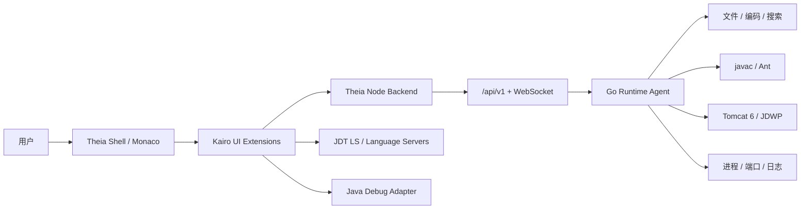

# Kairo IDE 三期产品化与投产总计划

> 文档状态：执行基线（Canonical Delivery Plan）  
> 版本：v1.0  
> 更新日期：2026-07-22  
> 适用项目：Kairo IDE  
> 目标读者：产品负责人、架构师、AI 开发工程师、测试工程师、发布负责人  
> 唯一任务入口：后续模型必须先阅读本文件，再领取和实施任务  

---

## 0. 文档定位与执行规则

本文综合 `docs/analysis/` 中多份模型分析、仓库现有需求与架构文档、当前代码实现、测试结果和产品目标，形成 Kairo IDE 后续开发的统一实施基线。

本文件回答五个问题：

1. 产品最终要解决什么问题。
2. 当前已经完成到哪里，真实缺口是什么。
3. 第一期、第二期、第三期分别交付什么。
4. 每个功能如何实现、如何测试、如何验收。
5. 多个 AI 开发工程师如何领取任务、记录证据并避免重复或冲突。

### 0.1 文档优先级

发生冲突时按以下顺序处理：

1. 用户最新明确指令。
2. 本文件中的阶段范围、质量门禁和验收标准。
3. `docs/product-requirements.md`、`docs/architecture.md`、`docs/ui-spec.md`。
4. ADR 决策记录。
5. 历史任务、分析报告和归档文档。

本计划对旧需求做一项明确调整：旧版 `product-requirements.md` 将 DAP/JDWP Debug 延后到 post-v1；根据最新产品目标，第一期必须完成“核心 Java Debug 闭环”，但以技术兼容性认证为前置条件。高级调试、JSP 调试和 HotSwap 仍放在后续阶段。

### 0.2 后续模型强制执行规则

每个 AI 工程师必须：

- 一次只领取一个可独立验收的任务 ID。
- 开发前阅读本文件、相关代码、相关 ADR 和任务依赖。
- 不得仅修改文档就宣称功能完成。
- 不得把模拟数据、空按钮、静态界面或仅单元测试通过视为产品闭环。
- 必须保留用户已有修改，不覆盖不相关变更。
- 必须补充自动化测试，并给出真实运行命令和结果。
- 涉及 UI 时必须提供正常、加载、空、错误、禁用五种状态。
- 涉及 Windows 时必须在真实 Windows 10 环境给出证据。
- 涉及 Java 6 时必须使用真实遗留样例和用户提供的合法 JDK 6 验证。
- 完成后在 `docs/progress/releases/` 下写入标准任务记录。

---

## 1. 产品结论

### 1.1 产品定位

Kairo IDE 不是通用 IDE，也不是 VS Code 的换皮版本。它是面向低配置、受限网络、遗留 Java Web 项目的轻量级专用 IDE，核心场景为：

- Windows 10 云桌面，2 vCPU / 4 GB RAM，无管理员权限。
- JDK 1.6、Tomcat 6、Servlet、JSP、XML、Ant 或自定义构建。
- GBK、UTF-8 混合编码。
- 企业内网、依赖离线、不能自由访问插件市场。
- 用户需要在一个产品内完成导入、理解、修改、搜索、构建、部署、运行、调试和问题定位。

### 1.2 核心价值

Kairo IDE 的竞争力不是插件数量，而是用更低资源和更短路径完成遗留项目维护：

1. 打开旧项目后不乱码、不破坏源码。
2. Java 语义能力可用，并把“分析 JDK”和“编译 JDK”分离。
3. 搜索、导航和结果展示接近 IntelliJ IDEA 的效率。
4. 构建、Tomcat 部署、日志和 Debug 形成一条可观察链路。
5. Windows 桌面版与 localhost 网页版共用同一套业务实现。
6. 出错时用户能看懂原因、定位日志并恢复，而不是面对无反馈按钮。

### 1.3 第一目标用户任务

第一期必须让用户完整完成以下旅程：

> 打开一个 GBK 的 JDK 6 / Tomcat 6 项目 → 搜索并定位代码 → 修改 Java/JSP → 构建 → 一键启动或部署 → 查看 Problems、构建输出和 Tomcat 日志 → 设置 Java 断点 → 发起请求命中断点 → 查看变量并单步 → 停止服务 → 下次打开恢复项目与配置。

只要其中任何关键环节需要用户切换外部编辑器、命令行或手工拼接复杂参数，第一期就不能视为完整交付。

### 1.4 明确非目标

第一期不做：

- 通用插件市场。
- AI 代码补全。
- Spring Boot / 云原生全栈开发。
- 数据库可视化设计器。
- 多用户远程开发平台。
- 性能分析器、火焰图。
- 任意 JVM 的无条件 HotSwap 承诺。
- 为了“像 IDEA”而复制所有复杂界面和功能。

---

## 2. 当前基线与真实缺口

### 2.1 已存在的可复用基础

仓库已经具备以下基础，不应重复建设：

- Theia + Monaco 前端壳层。
- Desktop 和 Browser 两种应用入口。
- Go Runtime Agent 及 `/api/v1` 协议基础。
- 工作区、文件、编码、构建、Tomcat 等扩展骨架。
- JDT LS 启停、文档同步、补全、定义跳转和诊断基础。
- 搜索后端与取消、编码处理的部分基础。
- `@theia/debug` 依赖基础。
- Mac Web 方向已有较完整验证记录。
- 单元测试、Go 测试、lint、E2E、性能和故障测试目录。

当前基线检查结果：

- `pnpm test`：通过。
- `go test -count=1 ./...`：通过。
- `pnpm lint`：通过。

这些结果只证明当前代码未发生明显基础回归，不等于核心用户旅程已经完成。

### 2.2 关键缺口

#### Java 语义能力

目前前端重点接入 completion 和 definition；引用查找、重命名、悬浮提示、符号搜索、签名帮助、实现跳转、层次结构、Code Action 等尚未形成完整产品闭环。

#### 搜索

搜索后端有基础，但缺少统一的 Kairo Search Center。用户需要的不是 VS Code 式“窄侧栏堆结果”，而是 IDEA 风格的快速定位、分组、预览、筛选和可控替换。

#### Debug

Theia Debug 框架已经存在，但缺少可交付的 Java Debug Adapter 接入和真实 breakpoint → request → hit → variables → step 证据。Tomcat 的 `debug=true` 只代表启动参数，不代表 IDE Debug 完成。

#### Windows

Mac 方向已有最终门禁记录；Windows 报告仍存在待完成项。Windows 无管理员安装、路径、中文目录、长路径、端口、进程树、杀毒软件干扰、WebView/浏览器行为都必须重新认证。

#### 产品 UI

部分面板仍偏原型化，存在内容稀疏、直接拼接 HTML、状态反馈不足、布局不统一等问题。需要建立统一 UI 状态模型和设计组件，而不是逐页补丁。

#### 交付与供应链

Tomcat/JDT LS 依赖、校验和、许可证、离线包、版本锁定、可复现构建和回滚链路必须固化。占位 checksum 不能进入正式发布。

### 2.3 最高技术风险：Java 6 兼容性

需要同时区分三种运行时：

| 角色 | 建议运行时 | 用途 |
|---|---|---|
| Kairo IDE / Node / Go | 产品支持的现代运行时 | IDE 自身运行 |
| JDT LS | 受支持的现代 JDK | 语义分析，不直接决定编译字节码 |
| 项目构建 / Tomcat | 用户导入的合法 JDK 6 | 真实编译和运行遗留项目 |

当前最新版 Eclipse JDT LS 对自身运行时要求较新；Eclipse JDT 新版本也已移除部分旧 source/target 支持。因此“最新版 JDT LS + Java 6 完整语义/编译兼容”不能凭经验承诺，必须建立兼容性测试矩阵，必要时锁定经过验证的 JDT LS 版本线。

参考：

- Eclipse JDT LS 官方仓库：<https://github.com/eclipse-jdtls/eclipse.jdt.ls>
- Eclipse 4.33 JDT 变化：<https://eclipse.dev/eclipse/news/news.html?file=4.33%2Fjdt.html>
- Microsoft Debugger for Java：<https://marketplace.visualstudio.com/items?itemName=vscjava.vscode-java-debug>

---

## 3. 总体架构方案

### 3.1 架构原则

1. 保留 Theia + Monaco，不重写编辑器核心。
2. Go Agent 负责平台相关、长任务和可控系统操作。
3. Node/Theia backend 负责前端扩展集成和协议适配。
4. 前后端协议版本化，所有长任务支持取消、进度和关联 ID。
5. Desktop 与 Browser 只在启动和系统集成层分叉，业务功能不分叉。
6. Java 语义分析、真实编译、Tomcat 运行三条链路解耦。
7. 所有用户操作都必须有状态、日志和可恢复错误。
8. 首选复用成熟协议和组件，不自研 Java parser、Debugger 或编辑器。

### 3.2 逻辑架构



### 3.3 模块边界

| 模块 | 主要职责 | 禁止事项 |
|---|---|---|
| `packages/project-extension` | 项目导入、模型、最近项目 | 不直接启动系统进程 |
| `packages/encoding-extension` | 编码检测、读取、保存策略 | 不静默转换源文件 |
| `packages/search-extension` | 搜索 UI、筛选、预览、替换计划 | 不绕过 Agent 直接扫大项目 |
| `packages/java-extension` | LSP 生命周期与 Monaco/Theia 能力桥接 | 不实现自有 Java parser |
| `packages/build-extension` | 构建配置、任务 UI、结果映射 | 不把 UI 线程变成长任务执行器 |
| `packages/tomcat-extension` | Server、部署、日志、运行配置 | 不复制构建逻辑 |
| `packages/runtime-extension` | Agent 连接、任务、健康状态 | 不承载具体业务 UI |
| `packages/ui-kit` | 设计 token 与可复用组件 | 不放业务状态和系统调用 |
| `runtime-agent` | 文件、搜索、构建、进程、端口、日志 | 不保存前端展示状态 |

### 3.4 API 统一要求

所有长任务响应至少包含：

```ts
interface KairoTaskRef {
  taskId: string;
  traceId: string;
  state: 'queued' | 'running' | 'succeeded' | 'failed' | 'cancelled';
  startedAt?: string;
  finishedAt?: string;
  message?: string;
}
```

所有错误统一包含：

```ts
interface KairoError {
  code: string;
  userMessage: string;
  technicalMessage?: string;
  traceId: string;
  retryable: boolean;
  suggestedActions?: string[];
}
```

禁止前端只显示 `Failed`、`Unknown error` 或原始堆栈。

---

## 4. 产品信息架构与 UI 设计

### 4.1 主页面布局

```text
┌────────────────────────────────────────────────────────────────────────────┐
│ 菜单 + 项目选择器 + 运行配置 + ▶运行 + 🐞调试 + ■停止 + 构建 + 发布       │
├──────┬──────────────────────────────────────────────┬──────────────────────┤
│活动栏│                                              │ Structure / Hierarchy│
│      │                编辑器区域                    │ 可折叠，默认窄栏      │
│项目  │        tabs / split / breadcrumb             │                      │
│搜索  │                                              │                      │
│Java  │                                              │                      │
│服务  │                                              │                      │
│调试  │                                              │                      │
│Git   │                                              │                      │
├──────┴──────────────────────────────────────────────┴──────────────────────┤
│ Problems | Search | Build | Run | Debug | Terminal                        │
├────────────────────────────────────────────────────────────────────────────┤
│ Git | JDK | Source | Encoding | EOL | Tomcat | Agent | Notifications      │
└────────────────────────────────────────────────────────────────────────────┘
```

### 4.2 布局原则

- 编辑器永远拥有最大面积。
- 左侧栏用于“选择对象”，底部面板用于“查看结果与过程”。
- 搜索条件可放左侧，但大量搜索结果默认进入底部或独立工具窗口。
- Debug 左侧展示 Variables、Watches、Call Stack、Breakpoints；底部展示 Debug Console。
- Tomcat 日志属于 Run/Server 输出，不与普通 Terminal 混在同一不可区分流中。
- 所有工具窗口支持拖拽、折叠、记忆尺寸和快捷键聚焦。
- 窄屏自动隐藏右侧栏，不压缩编辑区到不可用。

### 4.3 顶部工具栏

只保留最高频操作：

1. 当前项目。
2. 当前运行配置。
3. Run。
4. Debug。
5. Stop。
6. Build/Rebuild。
7. Publish。
8. Hot Reload 状态。

按钮必须满足：有 tooltip、有快捷键提示、有 loading/disabled 状态，不能重复触发同一任务。

### 4.4 IDEA 风格搜索模型

建立五种不同意图的入口：

| 用户意图 | 入口 | 结果形式 |
|---|---|---|
| 找文件 | `Ctrl/Cmd+Shift+N`，兼容 `Ctrl/Cmd+P` | 居中弹窗，模糊匹配、路径权重 |
| 找类/类型 | `Ctrl/Cmd+N` | 类型弹窗，显示包名和类型图标 |
| 找符号 | `Ctrl/Cmd+Alt+Shift+N` 或平台映射 | 方法、字段、常量列表 |
| 找操作 | `Ctrl/Cmd+Shift+A` | Actions 搜索，含快捷键 |
| 全文查找 | `Ctrl/Cmd+Shift+F` | 条件区 + 分组结果 + 预览 |

全文搜索必须支持：

- 普通文本、大小写、全词、正则。
- include/exclude glob。
- scope：项目、目录、模块、当前文件、选中范围。
- 按目录、文件或扁平模式分组。
- 文件类型、修改状态、生成目录过滤。
- 搜索历史和固定查询。
- 结果预览、上下文行、命中高亮。
- 流式输出、取消、结果数量上限和“继续加载”。
- 替换预览、逐条勾选、冲突检测、一次撤销。
- GBK/UTF-8 正确读取，不因搜索或替换改变原编码。

建议协议：

```text
POST   /api/v1/search/query
GET    /api/v1/search/{taskId}/events
POST   /api/v1/search/{taskId}/cancel
POST   /api/v1/search/replace-plan
POST   /api/v1/search/replace-apply
```

### 4.5 Debug 交互

核心 Debug 操作顺序：

1. 用户选择 `Tomcat 6: Debug` 运行配置。
2. IDE 校验 JDK、端口、项目构建状态和 Debug Adapter。
3. IDE 启动 Tomcat JDWP 或连接已有 JDWP。
4. 状态栏显示 `Waiting / Connecting / Connected / Paused / Terminated`。
5. 用户设置断点；断点需要显示未验证、已验证、禁用、条件断点状态。
6. 请求命中后自动聚焦源码行，显示线程、栈帧、变量和 Watches。
7. F10/F11/Shift+F11 执行单步；F8 继续。
8. Stop 先停止 Debug 会话，再按运行配置决定是否停止 Tomcat。

异常场景必须明确显示：

- Debug 端口被占用。
- JDWP 未开启。
- 源码与运行 class 不匹配。
- 断点无可执行代码。
- Adapter 进程退出。
- Java 6 目标与 Adapter/JVM 不兼容。

### 4.6 快捷键基线

默认采用 IDEA 肌肉记忆，同时保留 Theia/VS Code 常用兼容入口，发生冲突时提供首次提示和 Keymap 设置。

| 功能 | Windows/Linux | macOS |
|---|---|---|
| Search Everywhere | 双击 `Shift` | 双击 `Shift` |
| Find Action | `Ctrl+Shift+A` | `Cmd+Shift+A` |
| Find File | `Ctrl+Shift+N` | `Cmd+Shift+O` 或可配置 |
| Find Class | `Ctrl+N` | `Cmd+O` |
| Find in Files | `Ctrl+Shift+F` | `Cmd+Shift+F` |
| Replace in Files | `Ctrl+Shift+R` | `Cmd+Shift+R` |
| Recent Files | `Ctrl+E` | `Cmd+E` |
| Navigate Back/Forward | `Ctrl+Alt+←/→` | `Cmd+Option+←/→` |
| Go to Definition | `Ctrl+B` / `F12` | `Cmd+B` / `F12` |
| Find Usages | `Alt+F7` | `Option+F7` |
| Rename | `Shift+F6` / `F2` | `Shift+F6` / `F2` |
| Quick Fix | `Alt+Enter` | `Option+Enter` |
| Run | `Shift+F10` | `Ctrl+R` 或可配置 |
| Debug | `Shift+F9` / `F5` | `Ctrl+D` / `F5` |
| Toggle Breakpoint | `Ctrl+F8` / `F9` | `Cmd+F8` / `F9` |
| Resume | `F8` | `F8` |
| Step Over | `F10` | `F10` |
| Step Into | `F11` | `F11` |
| Step Out | `Shift+F11` | `Shift+F11` |
| Terminal | `Alt+F12` | `Option+F12` |

快捷键实现要求：

- UI tooltip 必须显示当前 keymap 的真实快捷键。
- 用户可搜索、修改、恢复默认和导入预设。
- 冲突检测必须指出两个命令和生效上下文。
- macOS 系统保留键不得被强制覆盖。

### 4.7 视觉与性能

- 默认深色和浅色主题，正文对比度达到 WCAG AA。
- 使用 `packages/ui-kit` token，不在业务组件散落硬编码颜色。
- UI 字号以 13px/20px 为主体，状态栏与提示可用 11–12px。
- 常用列表使用虚拟滚动；搜索、Problems、日志不得一次渲染全部数据。
- 不使用大面积阴影、背景模糊、持续动画或高成本滤镜。
- 动画限于 120–180ms，并尊重 `prefers-reduced-motion`。
- 图标优先复用现有图标集，避免加载大型图片资源。
- 任何刷新都不应造成编辑器丢焦点、滚动位置跳变或布局抖动。

---

## 5. 分期路线图总览

| 阶段 | 目标 | 预计周期 | 退出条件 |
|---|---|---:|---|
| 第一期 P1 | Windows 可投产的核心开发闭环 | 8–12 周 | 完成真实遗留项目导入、搜索、编辑、构建、运行、核心 Debug 和发布门禁 |
| 第二期 P2 | 提升 Java Web 日常生产力 | 6–8 周 | JSP/Servlet/XML 导航、重构、测试、Git、高级 Debug 可用 |
| 第三期 P3 | 扩展远程与企业级能力 | 8–12 周 | 远程 Linux、Maven、可选 HotSwap/JSP Debug、观测与规模化交付 |

阶段时间是工程估算，不允许以日期替代验收。上一个阶段的 P0/P1 缺陷未清零，不进入下一阶段主开发。

---

## 6. 第一期：最小完整投产版

### 6.1 第一期目标

第一期不是“功能多”，而是形成可真实工作的最短完整闭环。交付形态包括：

- Windows Desktop 正式包。
- Windows localhost Browser 启动包。
- macOS 作为开发和回归平台继续保持可用。
- 离线依赖、版本锁定、校验和、许可证清单。
- 用户手册、安装/运行/故障排查文档。

### 6.2 工作流 A：Windows 产品化

#### P1-WIN-01 无管理员安装与启动

实现：

- zip 解压即用或 per-user 安装，不写受限系统目录。
- Desktop 和 Browser 启动器统一检查端口、目录权限、依赖和残留进程。
- 路径包含中文、空格和较长目录时参数不丢失。
- 首次启动创建用户数据目录，升级时不覆盖工作区配置。

验收：

- Windows 10 普通用户可在全新环境启动。
- 安装目录分别覆盖英文、中文、空格路径。
- 关闭后无残留 Kairo/Agent/Tomcat 进程。

#### P1-WIN-02 进程、端口和恢复

实现：

- 父子进程树可追踪；Stop 和退出时优雅终止，超时后再强制终止。
- 端口占用显示 PID、进程名和可执行建议。
- Browser 模式异常退出后可识别孤儿 Agent/Tomcat。
- workspace、运行配置、面板状态和未保存恢复策略明确。

验收：

- 重复启动不产生多套冲突 Agent。
- 18080、调试端口、Agent 端口被占用时给出可理解错误。
- 崩溃重启后不损坏用户项目。

#### P1-WIN-03 发布供应链

实现：

- 固定 Node、Electron/Theia、Go、JDT LS、Tomcat 版本。
- 替换所有占位 checksum。
- 生成 SBOM、第三方许可证清单和依赖来源记录。
- 构建产物可复现并签名；至少提供 SHA-256。
- 发布包中不包含用户 JDK 6，提供导入和指纹校验。

验收：

- 离线构建/安装流程有证据。
- 任一依赖校验失败时构建立即失败。
- 发布包可从干净环境按文档重建。

### 6.3 工作流 B：项目、编码和编辑基础

#### P1-PRJ-01 项目导入向导

- 自动识别 `src`、`WebRoot`/`webapp`、`WEB-INF/lib`、`build.xml`、Tomcat 配置。
- 允许用户修改识别结果并保存为 `.kairo/project.json`。
- 检测 JDK、source/target、编码和输出目录。
- 不修改用户源码和原构建脚本，所有推断均可撤销。

#### P1-ENC-01 混合编码安全

- 项目级默认编码、目录级覆盖、单文件状态显示。
- 打开时检测，置信度低时提示而非静默猜测。
- 保存时保持原编码；转换编码必须二次确认并展示影响。
- 搜索、替换、构建日志和诊断位置均按正确编码处理。

#### P1-EDIT-01 编辑器交付

- 标签、分栏、breadcrumb、最近文件、自动保存策略。
- 大文件降级：关闭语义、minimap、复杂装饰和全文 tokenization。
- 未保存退出、外部修改冲突、只读文件处理。
- Java/JSP/XML/HTML/CSS/JS 基础语法和括号匹配。

### 6.4 工作流 C：Java LSP 能力闭环

#### P1-JAVA-01 兼容性认证

建立矩阵：

- 至少两条候选 JDT LS 版本线。
- JDT LS 运行 JDK 版本。
- 项目 source/target 1.6。
- 普通工程、Ant 工程、缺依赖工程、GBK 工程。
- completion、diagnostics、definition、references、rename、hover、symbols。

输出 ADR，锁定正式组合。未通过的组合不得进入 UI 选项。

#### P1-JAVA-02 LSP 生命周期

- 一个工作区一个可管理会话，避免重复进程。
- 启动、初始化、索引、ready、degraded、crashed 状态可见。
- JDT LS 崩溃自动限次重启，保留 traceId 和日志入口。
- workspace 关闭后释放进程和缓存锁。

#### P1-JAVA-03 核心语义能力

必须接通并测试：

- Completion 与签名帮助。
- Diagnostics → Problems。
- Definition、Implementation、References。
- Hover。
- Document Symbols、Workspace Symbols。
- Rename 预览与应用。
- Code Actions / Quick Fix 的安全子集。

验收使用真实遗留项目，不接受仅 mock LSP 测试。

### 6.5 工作流 D：IDEA 风格搜索中心

#### P1-SRCH-01 搜索后端

- 流式结果、取消、超时、最大结果限制。
- GBK/UTF-8、二进制排除、隐藏目录、symlink 策略。
- literal/word/case/regex/include/exclude/scope。
- 搜索事件携带 taskId、文件、行列、预览和编码。

#### P1-SRCH-02 Search Everywhere

- 双击 Shift 打开统一入口。
- Files、Types、Symbols、Actions 分类与 All 模式。
- 最近使用、模糊匹配、路径权重和键盘全操作。
- 输入期间取消前一查询，避免结果倒灌。

#### P1-SRCH-03 全文搜索与替换

- 结果按文件/目录分组，虚拟滚动。
- 右侧或内联预览；回车打开并准确定位。
- 替换前生成 replace plan，显示文件编码、修改条数和冲突。
- Apply 后形成单个可撤销事务；失败不得留下半替换状态。

性能门槛：10k 文件项目首次全文搜索目标 ≤ 3 秒；输入到首批结果目标 ≤ 300ms。

### 6.6 工作流 E：构建、部署和运行

#### P1-RUN-01 运行配置模型

建议结构：

```json
{
  "version": 1,
  "name": "Tomcat 6: legacy-sample",
  "type": "tomcat6",
  "projectId": "legacy-sample",
  "mode": "run",
  "jdkRef": "jdk6-local",
  "build": {
    "type": "ant",
    "target": "war"
  },
  "server": {
    "httpPort": 18080,
    "debugPort": 8000,
    "contextPath": "/legacy"
  },
  "deploy": {
    "mode": "exploded",
    "artifact": "dist/legacy"
  },
  "env": {}
}
```

- 配置可新建、复制、校验、导入导出。
- 密钥不写入项目文件。
- 项目级配置可进 Git，用户本地覆盖不进 Git。

#### P1-BLD-01 构建闭环

- 支持原生 Ant 和受控 javac 两种第一期路径。
- 输出结构化 diagnostic，映射到 Problems 和源码位置。
- 显示完整命令时脱敏，保留开始、耗时、退出码和 traceId。
- 支持取消，取消后必须终止子进程树。
- 增量编译目标 ≤ 2 秒，具体硬件和样例写入测试报告。

#### P1-TOM-01 Tomcat 生命周期

- Add/Configure/Start/Stop/Restart/Publish/Open Browser/View Logs。
- 状态机：stopped → starting → running → stopping → stopped；异常进入 error。
- 健康检查不能只看进程存在，至少检查端口和 HTTP endpoint。
- 日志 stdout/stderr 分流、增量读取、暂停、清空视图和保存。

#### P1-TOM-02 Hot Reload 最小能力

- JSP/CSS/JS 静态同步不触发 Context Reload。
- Java 修改走编译和重新发布，明确提示是否需要重启。
- UI 使用绿/黄/红状态说明当前变更的生效方式。
- 不承诺第一期 class HotSwap。

### 6.7 工作流 F：核心 Java Debug

#### P1-DBG-00 技术闸门

先完成最小探针，不先做完整 UI：

1. 使用用户合法 JDK 6 启动 Tomcat 6 JDWP。
2. 使用候选 Java Debug Adapter 连接。
3. 在真实 Java 6 class 中命中行断点。
4. 读取局部变量、调用栈并执行 step over/into/out。
5. 重复验证 Windows 10 与 macOS。

如果闸门失败，必须形成 ADR 和阻塞证据，第一期仍保留 Run 能力，但不得用伪 Debug UI 掩盖风险。

#### P1-DBG-01 Adapter 集成

- 复用 DAP 和成熟 Java Debug Adapter。
- 建立 adapter 启动、连接、日志、终止和异常恢复。
- 与 run configuration 共享 JDK、项目、classpath 和 Tomcat 信息。
- 调试端口只监听本地或明确受控地址。

#### P1-DBG-02 核心体验

- 行断点、启用/禁用、断点校验。
- Threads、Call Stack、Scopes、Variables、Watch。
- Continue、Pause、Stop、Step Over/Into/Out。
- Debug Console 基础输出。
- 启动、附加两种配置；第一期至少保证启动模式完整。

#### P1-DBG-03 Debug 验收场景

- 在 Servlet 中设置断点。
- Debug 启动 Tomcat。
- 浏览器请求目标 URL。
- IDE 自动停在正确源码行。
- 展开 request 参数和局部变量。
- Step Over 后变量变化正确。
- Continue 后页面正常响应。
- Stop 后 adapter 与 Tomcat 按策略退出，无残留进程。

### 6.8 第一期发布门禁

第一期只有全部满足才允许投产：

- Windows Desktop 和 Browser 两种形态通过核心旅程。
- 用户项目原编码未被破坏，仓库 diff 可证明。
- Java 核心语义能力通过真实工程测试。
- 搜索结果准确，替换可预览、可撤销。
- 构建、部署、运行、日志链路有 traceId。
- Debug 技术闸门通过；若未通过，版本不得宣传 Debug。
- 所有 P0/P1 缺陷关闭。
- checksum、SBOM、许可证、安装和回滚材料齐全。
- 冷启动目标 ≤ 8 秒；4 GB 机器长时间运行无明显泄漏。
- 安全检查无任意路径访问、命令注入或未授权远程监听。

---

## 7. 第二期：生产力增强版

### 7.1 第二期目标

在第一期稳定闭环之上，提高日常修改遗留 Java Web 项目的速度和准确性，不扩大成通用 IDE。

### 7.2 P2-WEB：JSP/Servlet/XML 跨语言能力

- JSP 中 Java 类型、方法、字段的跳转和引用。
- Servlet mapping 与 `web.xml` 双向导航。
- JSP include、taglib、静态资源路径导航。
- XML schema/DTD 基础提示和校验。
- EL 表达式基础补全与跳转，能力不足时明确降级。
- JSP/Java/配置文件之间的 Find Usages。

### 7.3 P2-JAVA：Java 生产力

- Call Hierarchy、Type Hierarchy。
- Organize Imports。
- Safe Delete、Extract Method 等经过验证的重构子集。
- 结构视图、继承标记、override/implementation gutter。
- Diagnostics 快速筛选和问题导航。
- 大型工程索引进度、暂停和缓存管理。

### 7.4 P2-GIT：轻量版本控制

- Changes、Diff、Stage、Commit、History、Blame。
- 文件修改状态在 Explorer、编辑器标签和状态栏一致。
- 提交前检查构建/测试，可配置但不强制联网。
- Local History：编辑器级快照、恢复和比较。
- 不在第二期实现复杂 rebase UI、Git LFS 和托管平台功能。

### 7.5 P2-TEST：测试体验

- JUnit 3/4 发现、运行、重跑、失败定位。
- 测试树、通过/失败/跳过状态。
- 单类、单方法、包级运行配置。
- 测试输出与普通 Run 输出分离。

### 7.6 P2-DBG：高级调试

- 条件断点、命中次数、日志断点。
- Evaluate Expression。
- 异常断点。
- Attach 到已有 Tomcat。
- 多线程切换和线程过滤。
- 断点分组、静音和持久化。
- 源码/class 不匹配的诊断与提示。

### 7.7 P2-UX：体验收敛

- 可搜索的 Settings 和 Keymap。
- Run/Debug 配置编辑器可视化。
- Welcome、Recent Projects、首次导入引导。
- 通知中心，避免大量 toast 干扰。
- 可访问性：键盘全操作、ARIA、焦点、对比度、缩放。
- UI 截图回归覆盖主要页面和状态。

### 7.8 第二期退出条件

- Java Web 跨文件导航在真实项目可用。
- 常用 Java 重构有预览、冲突提示和撤销。
- JUnit 与 Git 覆盖日常主路径。
- 高级 Debug 不破坏第一期核心 Debug 稳定性。
- 4 GB 环境完整工作日运行，无持续增长型内存泄漏。

---

## 8. 第三期：扩展与企业级能力

### 8.1 P3-REMOTE：远程 Linux 开发

- 浏览器连接远程 Kairo Agent。
- 认证、TLS、工作区沙箱、审计、超时和重连。
- 前端与远端文件、搜索、构建、运行协议保持一致。
- 多用户数据隔离；禁止直接把本地 Agent 暴露到公网。
- 弱网下增量同步、断线状态和任务恢复。

### 8.2 P3-MAVEN：遗留 Maven 支持

- `pom.xml` 识别、依赖树、offline 模式。
- 生命周期任务和 Problems 映射。
- Maven 使用的 JDK 与项目运行 JDK 可分离配置。
- 仅支持遗留维护高频能力，不复制完整 Maven GUI。

### 8.3 P3-ADVDBG：可选高级调试

技术验证通过后再进入正式范围：

- Class HotSwap。
- JSP 断点及生成 Servlet 源映射。
- 远程 JDWP 安全隧道。
- 多模块/多进程调试。

任何不稳定能力必须标记 Experimental，不得默认启用。

### 8.4 P3-DATA：轻量 SQL 工具（可选）

- Oracle 11g 连接配置和安全凭据存储。
- SQL 编辑、执行、结果分页和导出。
- 只读模式和危险语句确认。
- 不做数据库建模器和全功能 DBA 工具。

### 8.5 P3-OBS：企业观测与维护

- 本地诊断包：版本、日志、配置摘要、环境检查，自动脱敏。
- 发布遥测默认关闭；企业管理员可显式配置。
- 性能采样、崩溃报告和任务 trace 关联。
- 升级检查、离线升级包、回滚和配置迁移。

### 8.6 第三期退出条件

- 远程访问通过安全评审和多用户隔离测试。
- Windows 本地能力不因远程架构重构而退化。
- Experimental 功能与稳定功能在 UI、文档和配置中清楚区分。
- 企业部署、升级、回滚和诊断流程均可演练。

---

## 9. 性能与资源预算

### 9.1 目标环境

- Windows 10，2 vCPU，4 GB RAM。
- 10k 文件遗留 Java Web 项目。
- 机械盘/低速云盘和杀毒实时扫描均需纳入观察。

### 9.2 核心预算

| 指标 | 第一期目标 | 测量口径 |
|---|---:|---|
| 冷启动到工作区可操作 | ≤ 8s | 从启动器点击到 Explorer/Editor 可操作 |
| 打开普通文本文件 | P95 ≤ 300ms | 不含首次大型索引 |
| 首次 Java completion | ≤ 1.5s | JDT LS ready 后首次触发 |
| 后续 completion | P95 ≤ 500ms | 同一会话 |
| 增量编译单文件 | ≤ 2s | 固定样例、固定硬件 |
| 10k 文件全文搜索 | ≤ 3s | 冷/热缓存分别记录 |
| 搜索首批结果 | ≤ 300ms | 流式首屏 |
| UI 输入响应 | P95 ≤ 100ms | 键盘到可见反馈 |
| 空闲 CPU | 平均 < 3% | 无索引、无构建、无日志增长 |
| 稳态总内存 | 建议 < 1.2 GB | Shell + Agent + JDT LS，不含 Tomcat/JDK6 |

### 9.3 性能工程要求

- 建立基线数据，不以开发机体感代替测量。
- 搜索、日志、Problems、Git changes 全部虚拟化。
- WebSocket 事件批处理，每帧更新有上限。
- LSP 文档变更去抖，但不得丢版本顺序。
- 索引、搜索和构建支持取消并释放资源。
- 大文件采用降级模式，阈值可配置并有提示。
- 自动化性能门禁关注回归百分比和绝对阈值。

---

## 10. 测试与审查方案

### 10.1 测试金字塔

1. 单元测试：状态机、解析、配置、编码、路径和 UI reducer。
2. 协议/契约测试：前端、Node 和 Go Agent 请求响应一致性。
3. 集成测试：真实进程、JDT LS、Ant/javac、Tomcat、Debug Adapter。
4. E2E：Desktop 和 Browser 的完整用户旅程。
5. 性能测试：启动、搜索、补全、构建、日志和内存。
6. 故障测试：端口占用、进程崩溃、权限、磁盘满、编码错误、断连。
7. 安全测试：路径穿越、命令注入、WebSocket/HTTP 边界和本地监听。

### 10.2 平台矩阵

| 维度 | 必测组合 |
|---|---|
| OS | Windows 10 主门禁；macOS 回归；Linux 第三期 |
| 形态 | Desktop、localhost Browser |
| 路径 | 英文、中文、空格、长路径 |
| 编码 | UTF-8、GBK、混合项目 |
| 构建 | javac、Ant |
| Java | JDK 6 项目 + 锁定的 JDT LS 运行 JDK |
| Tomcat | 6.0.53 主版本；必要时验证 6.0.30 |
| 网络 | 离线、本地端口冲突、代理环境 |

### 10.3 核心 E2E 场景

- E2E-01：首次启动 → 导入项目 → 编码正确。
- E2E-02：Java completion → definition → references → rename。
- E2E-03：全文搜索 → 预览 → 替换 → undo。
- E2E-04：构建失败 → Problems → 跳转 → 修复 → 构建成功。
- E2E-05：启动 Tomcat → 打开浏览器 → JSP 修改即时生效。
- E2E-06：Java 修改 → 构建 → 发布 → 服务恢复。
- E2E-07：Debug → 断点命中 → 变量 → 单步 → 停止。
- E2E-08：关闭重开 → 最近项目与运行配置恢复。
- E2E-09：端口占用 → 诊断 → 修改端口 → 重试成功。
- E2E-10：Agent/JDT LS 异常退出 → 用户可见 → 自动或手动恢复。

### 10.4 代码审查清单

每个任务合并前必须回答：

- 是否符合模块边界，是否重复已有能力？
- 是否改变协议，协议和契约测试是否同步？
- 是否正确处理 Windows 路径、中文、空格和进程树？
- 是否正确处理 GBK 和原编码保存？
- 是否有取消、超时、错误状态和日志关联？
- 是否引入主线程阻塞、无界列表或频繁重渲染？
- UI 是否具备加载、空、错误、禁用和成功状态？
- 是否有可访问性标签和键盘操作？
- 是否包含真实集成证据，而不只是 mock？
- 是否更新任务记录和相关文档？

### 10.5 缺陷等级

- P0：数据损坏、安全漏洞、无法启动、核心功能完全不可用。
- P1：核心旅程中断、搜索/构建/Debug 结果错误、不可恢复崩溃。
- P2：有替代路径但明显影响效率或体验。
- P3：视觉、文案和低频体验问题。

发布时 P0/P1 必须为 0；P2 必须有负责人、原因和修复版本。

---

## 11. AI 多模型协作与进度记录

### 11.1 任务拆分标准

一个任务必须：

- 目标单一，通常 0.5–3 个工程日可完成。
- 明确输入文件、输出文件和不应修改的边界。
- 明确依赖任务。
- 有自动化测试和人工验收步骤。
- 有可回滚方式。

禁止使用“完善搜索”“优化 UI”“实现 Debug”这类无法独立验收的大任务名；必须拆成协议、后端、状态模型、组件、集成和 E2E。

### 11.2 状态定义

| 状态 | 含义 |
|---|---|
| `planned` | 已规划，未领取 |
| `in_progress` | 已领取并开发中 |
| `implemented` | 代码完成，等待审查/验证 |
| `verified` | 测试和验收通过 |
| `blocked` | 有证据的外部或技术阻塞 |
| `deferred` | 经产品决策延后 |

只有 `verified` 才计入阶段完成率。

### 11.3 进度文件位置

```text
docs/progress/releases/
├── phase-1/
│   ├── P1-JAVA-01.md
│   ├── P1-SRCH-01.md
│   └── ...
├── phase-2/
└── phase-3/
```

### 11.4 单任务记录模板

```markdown
# <TASK-ID> <任务名称>

- 状态：planned | in_progress | implemented | verified | blocked | deferred
- 负责人/模型：
- 开始时间：
- 完成时间：
- 基线提交：
- 最终提交：
- 依赖任务：

## 目标

## 用户价值

## 范围

## 非范围

## 实现摘要

## 修改文件

## 接口/数据结构变化

## 测试命令与结果

## 人工验收步骤与证据

## 性能数据

## 风险与遗留问题

## 审查结论

## 回滚方式
```

### 11.5 多模型协作顺序

推荐每个开发波次采用：

1. 架构/产品模型确认任务边界和验收标准。
2. 实现模型完成代码和自动化测试。
3. 独立审查模型检查正确性、边界、性能和安全。
4. 测试模型执行真实环境和 E2E。
5. 主模型汇总证据并把状态改为 `verified`。

同一模块同一时间原则上只允许一个实现任务修改核心文件，避免多个模型互相覆盖。

---

## 12. 第一期推荐开发顺序

### Wave 0：基线冻结与风险探针（第 1 周）

1. 固化当前自动化测试和性能基线。
2. 完成 Windows 干净环境启动测试。
3. 完成 Java 6 + JDT LS 兼容矩阵。
4. 完成 Java 6 + Tomcat 6 + Debug Adapter 技术闸门。
5. 固定依赖版本和正式 checksum。

退出条件：最高风险有证据结论，不能带着未知兼容性直接堆 UI。

### Wave 1：项目与语义基础（第 2–4 周）

1. 项目导入和配置模型。
2. 编码保存安全。
3. JDT LS 生命周期与状态。
4. References、Hover、Symbols、Rename、Quick Fix。
5. Problems 和状态栏统一反馈。

### Wave 2：搜索中心（第 3–5 周，可与 Wave 1 的独立部分并行）

1. 搜索 API 契约和流式事件。
2. 搜索后端取消、编码和过滤。
3. Search Everywhere。
4. 全文搜索结果、预览、替换事务。
5. 10k 文件性能测试。

### Wave 3：构建与 Tomcat（第 5–7 周）

1. Run Configuration。
2. Ant/javac 构建闭环。
3. Tomcat 状态机、健康检查和日志。
4. Publish 和静态 Hot Reload。
5. 错误恢复和端口诊断。

### Wave 4：核心 Debug（第 6–9 周）

1. Adapter 正式接入。
2. Run/Debug 状态统一。
3. Breakpoints、Call Stack、Variables、Watch。
4. Step 和 Debug Console。
5. Servlet 真实请求 E2E。

### Wave 5：Windows 收口与发布（第 9–12 周）

1. Desktop/Browser 双形态回归。
2. 低配置性能和长稳测试。
3. 故障、安全、安装、升级、回滚演练。
4. UI 视觉与可访问性审查。
5. 文档、SBOM、许可证和发布签名。
6. Release Candidate → 缺陷清零 → Production。

---

## 13. Definition of Done

任何功能只有同时满足以下条件才算完成：

- 用户入口真实可见且交互完整。
- 正常、加载、空、错误、取消、重试状态完整。
- 前后端真实链路接通，无 mock 或固定数据。
- 单元、契约、集成测试通过。
- 至少一个真实用户场景 E2E 通过。
- Windows 主平台验证通过；平台不相关任务需说明理由。
- 无明显性能回归，必要时提交测量数据。
- 安全、编码、路径和进程边界已审查。
- 文档和任务进度记录更新。
- 独立审查完成，遗留风险明确。
- 有明确回滚方式。

“代码已写”“能编译”“测试文件存在”“按钮能点击”都不等于 Done。

---

## 14. 关键决策与假设

1. 第一发布版本包含核心 Java Debug，但高级 Debug 延后。
2. 本文件作为后续实施的唯一总计划；旧文档保留作为背景和专项规范。
3. 后续采用多 AI 分波次实施，并进行独立审查和真实环境验证。
4. 用户提供合法 JDK 6；产品不打包和分发 JDK 6。
5. Windows 10 是第一期最终发布门禁平台，macOS 不能替代 Windows 证据。
6. Desktop 与 localhost Browser 是一期同产品的两种形态。
7. Remote Linux 属于第三期，不能提前污染一期本地架构。
8. Java 6 语义与 Debug 以兼容性探针结果为准，不做无证据承诺。
9. UI 追求 IDEA 的任务效率和快捷键习惯，不复制 IDEA 的全部复杂度。

---

## 15. 立即可领取的首批任务

| 顺序 | 任务 ID | 交付物 | 依赖 |
|---:|---|---|---|
| 1 | P1-BASE-01 | 当前测试、性能、包体和内存基线报告 | 无 |
| 2 | P1-JAVA-01 | Java 6 / JDT LS 兼容矩阵与 ADR | P1-BASE-01 |
| 3 | P1-DBG-00 | Java 6 / Tomcat 6 / DAP 技术闸门报告 | P1-BASE-01 |
| 4 | P1-WIN-01 | Windows 10 无管理员启动与路径矩阵 | P1-BASE-01 |
| 5 | P1-SUPPLY-01 | 正式版本锁、checksum、许可证清单 | 无 |
| 6 | P1-PRJ-01 | 项目导入模型与向导任务拆分 | P1-JAVA-01 |
| 7 | P1-SRCH-01 | 搜索 API 契约和契约测试 | P1-BASE-01 |

优先执行 1–5。只有兼容性和 Windows 风险得到证据后，才大规模进入功能 UI 开发。

---

## 16. 最终交付清单

第一期正式交付至少包含：

- Windows Desktop 安装/便携包。
- Windows localhost Browser 启动包。
- 固定版本的 Kairo 前端、Go Agent、JDT LS、Tomcat 6。
- 完整 checksum、SBOM、许可证和来源记录。
- 项目导入、搜索、Java 编辑、构建、部署、运行、日志、核心 Debug。
- 用户手册、快捷键表、故障排查和 Debug 指南。
- 管理员/部署说明、升级和回滚说明。
- 自动化测试报告、Windows E2E 证据和性能报告。
- 已知问题、限制和后续路线图。
- `docs/progress/releases/phase-1/` 下所有任务的验证记录。

当以上内容完整、第一期门禁全部通过后，Kairo IDE 才具备“可交付、可安装、可使用、可维护、可回滚”的投产资格。

