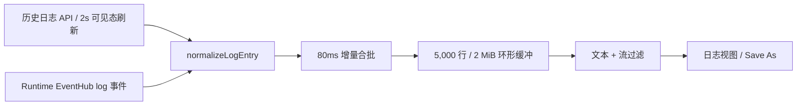

# P1-TOM-01A：轻量 Tomcat Logs 真实数据切片

## 状态

- 状态：`implemented`
- 负责人：Codex Tomcat Logs Agent
- 完成日期：2026-07-23
- 范围：Tomcat 日志查看器，不包含运行配置、Debug、构建与搜索功能

## 用户价值

用户可以在 Kairo IDE 内选择真实服务器，查看由 Runtime API 历史接口和事件流提供的 stdout、stderr 与结构化日志；无需切换外部终端，也不会因为长时间运行而无限占用浏览器内存。

## 已实现能力

| 能力 | 实现与行为 |
|---|---|
| 真实历史日志 | 服务器切换时请求 `GET /api/v1/servers/{serverId}/logs`，不生成演示日志 |
| 真实增量 | 保留 `RuntimeConnectionService.subscribeEvents` 的 `log` 事件链路；因当前后端尚未发布 server log 事件，同时提供 2 秒历史尾部刷新兜底 |
| 有界刷新 | 仅在 Runtime open、已选服务器、页面可见且组件进入可视区域时启用；上一请求完成后才计划下一次，切换/隐藏/卸载会清理 timer 并使旧响应失效 |
| 断线状态 | 显示 `connecting/open/disconnected/closed`；重连补拉历史；loading/error 状态可见，错误可手动 Retry |
| 服务状态 | 服务器选择器与状态栏展示 running/stopped 等真实状态；目标服务器消失时优先切换到运行中服务器 |
| Pause / Resume | Pause 冻结视图但继续将真实日志写入有界缓冲，并显示暂停缓冲状态；事件增量可显示接收数量，Resume 一次刷新 |
| Clear view | 仅清空浏览器内存视图并保留稳定历史水位；后续轮询不会复活 Clear 前的旧行，也不调用删除、截断或清理磁盘日志接口 |
| Auto-scroll | 默认开启，可由用户关闭；只有新视图发布时滚动到底部 |
| 过滤 | 支持大小写不敏感文本过滤，以及 all/stdout/stderr/structured 流过滤；过滤不修改原始缓冲 |
| 级别/流辨识 | 后端从持久化 `[stdout]`/`[stderr]` 标记恢复真实流并返回；前端保留 stdout/stderr/structured 标签；stderr 与错误关键词归为错误，warning 关键词归为警告 |
| Save As | 仅导出当前过滤后的可见内容；文件名清洗路径及非法字符并限制服务 ID 长度；导出后释放 Blob URL |
| 内存上限 | 环形缓冲最多 5,000 行且最多 2 MiB UTF-8 数据，达到任一限制即从最旧日志开始淘汰；单条超限日志拒绝进入缓冲 |
| 后端读取上限 | `tail` 最大 5,000 行；最多检查 32 个最新 regular file；每文件最多尾读 2 MiB、单次总计最多 8 MiB；跳过目录、特殊文件和符号链接；返回 source + byte ordinal 稳定身份 |
| 可访问性 | 使用原生 button/select/input/checkbox，工具栏、状态区、日志区具备 ARIA 语义，可用键盘 Tab/Space/Enter 操作 |
| 主题 | 颜色使用 Kairo/Theia 主题变量；错误、辅助文本与控件在暗色和高对比主题下继承主题色，不使用大面积阴影或动画 |

## 数据流与性能约束



- 当前后端 EventBus 尚未发布 server log 事件，因此使用 2 秒可见态兜底刷新保证真实增量；严格串行、可取消且不可见时停止，避免轮询风暴。未来接通事件发布后应移除此兜底。
- 每次历史请求有 generation/stale guard；服务器快速切换、重连或组件卸载后，旧 Promise 不能覆盖新服务器。后端使用文件 modTime 作为稳定批次时间，并返回 source + byte ordinal；前端水位追踪器只追加未见项，重复轮询为零增量，截断/轮转时 ordinal 回退会安全重置该 source。
- 暂停只冻结渲染快照，不暂停后端事件订阅，避免恢复后丢失日志；内存上限在暂停期间仍然生效。
- 每 80ms 至多发布一次 React 状态，降低高频 stdout/stderr 对主线程的压力。
- Save As 不申请文件系统写权限，使用浏览器标准下载；不触碰服务端磁盘日志。

## 文件清单

- `packages/tomcat-extension/src/browser/log-viewer-widget.tsx`：日志 UI、真实数据订阅、连接与服务器状态、暂停/清空/过滤/导出。
- `packages/tomcat-extension/src/browser/log-buffer.ts`：日志规范化、有界缓冲、过滤和安全文件名。
- `packages/tomcat-extension/src/browser/log-buffer.test.cjs`：缓冲上限、流分类、过滤、文件名与 Clear 语义测试。
- `packages/ui-kit/src/browser/kairo-theme.css`：响应式工具栏、状态栏和日志流主题样式。
- `runtime-agent/internal/services/server.go`：有界日志尾读、regular file/symlink 防护、真实 stdout/stderr 标记恢复。
- `runtime-agent/internal/api/services.go`：日志响应增加可选 `stream` 字段。
- `runtime-agent/internal/services/server_restart_logs_test.go`：硬 tail 上限、大文件尾读和 symlink 防逃逸测试。

## 自动化验证

```text
pnpm --filter @kairo/tomcat-extension build  PASS
pnpm --filter @kairo/tomcat-extension test   PASS (23/23)
pnpm --filter @kairo/tomcat-extension lint   PASS
pnpm build:product                           PASS
go test ./internal/services ./internal/api   PASS
```

新增日志专项测试覆盖：行数/UTF-8 字节上限、超大单条拒绝、流/级别/结构化规范化、组合过滤、安全文件名、内存 Clear、历史/实时合并、重复轮询、Clear 水位、追加与轮转、订阅/timer/下载 URL 清理契约、可见态串行轮询契约。Go 侧覆盖硬 tail 上限、大文件尾读、symlink 防逃逸和稳定 source/ordinal 身份。

## 人工验收步骤

1. 启动 Runtime 与一个 Tomcat 服务，打开 Server Logs，确认历史日志和新 stdout 行均来自该服务。
2. 触发 stderr，确认 `[stderr]` 标签及错误色；发送对象型事件时确认显示 `[structured]`。
3. Pause 后持续产生日志，确认正文不滚动且接收计数增长；Resume 后一次性出现新日志。
4. 输入文本过滤并切换流过滤，确认二者组合生效；清空输入后恢复缓冲中的全部日志。
5. 点击 Clear view，确认当前视图清空；重连或重新选择服务器后历史仍可由服务端获取，磁盘日志未删除。
6. 过滤后 Save As，确认下载内容仅为可见日志且文件名无路径穿越字符。
7. 断开并恢复 Runtime，确认状态变化和错误重试可见；切到后台/隐藏面板后停止刷新，返回后以约 2 秒间隔串行刷新且无重叠请求。
8. 使用键盘完成服务器切换、Pause/Resume、Clear、Save As、Auto-scroll 和过滤；在暗色/高对比主题下检查焦点和文字可读性。

## 已知边界与后续

- 当前“结构化”依据真实事件中的对象型 `line/message` 识别；后端尚无独立结构化日志 schema。若后续协议增加 traceId、logger、thread 等字段，应在协议层定义并增加字段筛选，不应在前端猜测。
- 当前自动化覆盖纯逻辑与扩展编译；窗口化大流量、浏览器下载、屏幕阅读器和高对比视觉仍需在 Windows/Web 目标环境做人工验证后才可标记 `verified`。
- 后续可在不突破轻量目标的前提下增加“复制选中行”和按级别过滤；虚拟列表仅在 5,000 行实测仍出现帧率问题时引入。

## 退出条件

- [x] 真实历史和事件增量链路
- [x] Pause/Resume、Clear view、Auto-scroll、文本/流过滤、Save As
- [x] 行数与字节双上限
- [x] 服务器切换、停止与连接状态可见
- [x] 无高频或重叠轮询；兜底刷新严格受连接与可见态约束
- [x] 键盘与主题基础适配
- [x] TypeScript 编译、23 项扩展测试、lint 与产品构建通过
- [x] Go services/API 专项测试通过
- [ ] Windows/Web 真实 Tomcat 长时间运行与高对比人工验收
